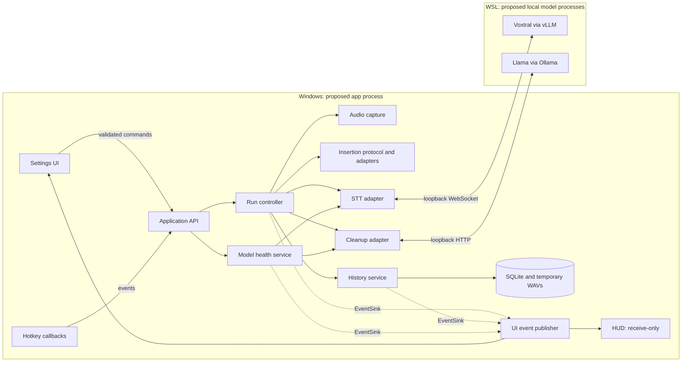

# Wispr Clone — Backend Codemap (Python)

Status: **planning only**. This document specifies the proposed implementation; it does not report working backend code or completed runtime checks.

## 1. Purpose, scope, and status

Use this map to find where a responsibility belongs, follow a dictation through the system, and identify the checks required before implementation can advance. Detailed package choices and setup considerations live in [DEPENDENCIES.md](DEPENDENCIES.md). Diagrams of module dependencies and trust boundaries live in [CODEMAP_GRAPH.md](CODEMAP_GRAPH.md).

| Read in order | Question answered |
|---|---|
| 1. Purpose, scope, and status | What exists, and what are we building? |
| 2. Runtime diagram and ownership of state | Where does each part run, and who may change state? |
| 3. Module map and allowed dependencies | Where does code belong, and which direction do calls go? |
| 4. Run lifecycle, failure branches, and recovery | What happens on success, failure, cancellation, and restart? |
| 5. Data ownership and retention | What is stored, for how long, and under which guarantees? |
| 6. UI integration boundary | Which prototype behavior must be replaced? |
| 7. Open decisions and validation gates | Which assumptions need a decision or measured evidence? |
| 8. Build order linked to acceptance checks | What is the next small, verifiable implementation step? |

### Existing assets and authority

- [Feature specification](../research/voice-dictation-features.md): authority for product behavior and acceptance checks.
- [Model notes](../research/notes_1.md): selected model targets. [Original prompts](../research/prompts_1.md) provide background; the feature specification resolves their behavior into requirements.
- [UI prototype](../ui_development/code/README_final.md): existing HTML/CSS/JS, mock application data, and microphone-driven visualization. It is a visual reference, not a backend behavior contract.
- `backend_dev/`: planning documents only. Every source file, manifest, script, migration, and test named below is **planned**.

**Status vocabulary:** **selected** means recorded in the project requirements or model notes; **proposed** means a design choice in this plan; **unverified** means compatibility or behavior still requires evidence. A selected model can still have unverified runtime compatibility.

**Selected scope:** Windows dictation with development in WSL; configurable hold/toggle/cancel controls; local STT and optional cleanup; persistent settings/dictionary; temporary history; destination verification and explicit recovery. No accounts, permanent transcript archive, arbitrary voice commands, or automatic submission.

**Proposed baseline:** Python 3.12, one modular Windows application, two local WSL model processes, SQLite, and a native host for the existing web UI. Voxtral 4B Realtime 2602 and Llama 3.1 8B Instruct are selected model targets; vLLM, Ollama, and pywebview remain proposed hosts.

**Design rationale:** organize around responsibilities and observable behavior before fixing package versions or creating files. This keeps implementation choices replaceable while preserving the product requirements.

## 2. Runtime diagram and ownership of state

The proposed Windows app owns desktop interaction and local data. WSL hosts inference. Windows and WSL use separate environments; packages are not shared. The model endpoints are local network boundaries, even though no cloud service is needed for the default workflow.



Dashed arrows are calls through the injected `EventSink` interface: producers never import the UI.

| Execution context | Ownership and handoff |
|---|---|
| Main GUI thread | Window lifecycle and UI rendering; never changes a run directly |
| Worker thread with an asyncio event loop | Application commands, run state, model requests, history retention, and the single SQLite writer |
| Hotkey listener | Compares each key against the configured bindings and immediately discards every other key. Posts only start/stop/cancel events to the worker. Never logs, buffers, or forwards keystrokes; performs no blocking work |
| Audio callback | Copies frames to a bounded queue; processing, WAV writes, and network calls happen outside the callback |
| JS bridge callbacks | Validate and enqueue commands; do not call repositories or mutate state on the callback thread |

Only the worker mutates authoritative application state. UI events carry snapshots; UI controls request changes. Model readiness and run state are separate: a background health poll must not overwrite the HUD state of an active run.

Permit one live dictation and one insertion dispatch at a time. The audio device lease (§3) rejects mic testing during capture and capture during a mic test; callers do not coordinate this themselves. Reject overlapping starts. Snapshot settings, selected models, and dictionary guidance at run start so edits affect the next run. Give network operations deadlines; queue overflow ends the run with an explicit error instead of silently dropping speech. Exact timeouts and buffer bounds are measured in §7.

**Design rationale:** one owner for state makes cancellation, duplicate commands, and recovery understandable without introducing a second application service or message broker.

## 3. Module map and allowed dependencies

### Planned layout

```text
backend_dev/
├── CODEMAP.md                          this responsibility and behavior map
├── CODEMAP_GRAPH.md                    dependency, fan-in/out and trust-boundary diagrams
├── DEPENDENCIES.md                     proposed packages, alternatives, setup and keys
├── pyproject.toml / uv.lock            Windows app dependencies and validated lockfile
├── .python-version                     proposed runtime
├── src/wispr_clone/
│   ├── __main__.py / app.py            entry point; compose services, wire callbacks, threads, windows; single-instance lock
│   ├── config.py                      paths and validated operational limits
│   ├── contracts/                     cross-package types only; no services, no I/O
│   │   ├── common.py                  Result {ok, data, error}, ErrorCode enum, request/run identifiers
│   │   ├── events.py                  EventSink protocol and event payloads
│   │   ├── run.py                     RunStatus, CleanupStatus, AttemptOutcome
│   │   └── shortcuts.py               KeyBinding type and pure shortcut parser/validator
│   ├── application/
│   │   ├── api.py                     thin router: validated command name → handler; dispatch onto worker
│   │   ├── commands/
│   │   │   ├── run_commands.py        run_start/stop/cancel/recover
│   │   │   ├── audio_commands.py      mic_list, mic_test_start/stop
│   │   │   ├── model_commands.py      models_status/test/select
│   │   │   ├── settings_commands.py   settings_get/update, state_get snapshot
│   │   │   ├── dictionary_commands.py dict_*
│   │   │   └── history_commands.py    history_*
│   │   └── model_service.py           aggregate readiness, model tests and selection using injected adapters
│   ├── ui/
│   │   ├── windows.py / overlay.py     settings window (with bridge) and non-activating HUD (no bridge); navigation lock
│   │   └── bridge.py / events.py       validated commands in; EventSink implementation serializing events out
│   ├── pipeline/
│   │   ├── state_machine.py           transitions, recovery permissions, cancellation boundary
│   │   ├── run_controller.py          coordinate one run using injected services
│   │   └── insertion_protocol.py      sole owner of claim → recheck → dispatch → outcome (§4)
│   ├── hotkeys/
│   │   └── hotkey_service.py          low-level hook; matches parsed KeyBindings, discards all other keys
│   ├── audio/
│   │   ├── device_lease.py            exclusive device ownership: capture or mic test, never both
│   │   ├── devices.py / capture.py / resample.py
│   │   └── wav_writer.py / level_meter.py
│   ├── stt/
│   │   └── base.py / voxtral_realtime.py   streaming protocol, file replay for retry, local adapter
│   ├── cleanup/
│   │   └── base.py / ollama_cleanup.py / prompt_builder.py / guard.py
│   ├── dictionary/
│   │   └── repo.py / apply.py / import_export.py
│   ├── history/
│   │   └── repo.py / retention.py      run and attempt records, expiry, eviction notices, file cleanup
│   ├── insertion/
│   │   ├── destination.py / verifier.py
│   │   └── inserter.py / app_strategies.py / win32.py
│   ├── models/
│   │   └── registry.py                model/endpoint metadata only; no health orchestration
│   ├── settings/
│   │   └── schema.py / store.py
│   ├── storage/
│   │   └── db.py / migrations/        SQLite writer and ordered schema migrations
│   └── util/
│       └── logging_setup.py / error_messages.py   ErrorCode → user explanation and recovery actions
├── web/
│   ├── index.html / styles.css / assets/   packaged presentation based on the prototype
│   ├── app.js / waveform.js            render backend state and backend audio levels
│   └── bridge-adapter.js               commands, subscriptions, initial snapshot and errors
├── scripts/
│   ├── setup-models.sh / start-stt.sh / start-cleanup.sh / check-gpu.sh
│   └── .env.example                    WSL download credential names only (e.g. HF_TOKEN); no values
├── packaging/wispr_clone.spec          proposed Windows executable packaging
└── tests/
    ├── unit/                          transitions, retention, matching, guard and validation
    ├── integration/                   fake adapters, recovery, crash boundaries and bridge
    ├── fixtures/                      short WAVs and deterministic service responses
    └── eval/                          cleanup meaning-preservation examples
```

Optional later files, subject to §7: `stt/cloud_stt.py`, `settings/secrets.py`, and `models/wsl_launcher.py`. No placeholder implementations are needed now.

### Contracts and dependency direction

Dependencies below are application modules, excluding stdlib and their private third-party adapters. Every module may import `contracts/`, `config`, and `util`; those never import anything above them.

**Contracts rule:** a type belongs in `contracts/` only when at least two packages outside its owner need it. Otherwise it stays in its owning package (for example, device info in `audio/`, dictionary entries in `dictionary/`). This keeps `contracts/` small and split by concern, so changing one domain does not ripple through every module.

| Module | Public responsibility/interface | Allowed application dependencies |
|---|---|---|
| `app` | Construct adapters and services, wire callbacks and the event sink, start and shut down | Composition root; may wire all modules |
| `application.api` | Validated command name → handler lookup; no domain logic | `application.commands` only |
| `application.commands.*` | One handler module per command group | Each depends only on its own service: run → `pipeline`; audio → `audio`; model → `model_service`; settings → `settings`, `model_service` (readiness snapshot); dictionary → `dictionary`; history → `history` |
| `application.model_service` | `status()`, `test(model_id)`, `select(model_id)`; aggregate health | `models.registry`, `settings`, injected `stt.base` and `cleanup.base` interfaces, `EventSink` |
| `ui.bridge` / `ui.events` | Validate commands; implement `EventSink` by serializing payloads | `application.api` and `contracts` only; no storage, insertion, or model clients |
| `pipeline.run_controller` | `start`, `stop`, `cancel`, `recover`, `abort(run_id)`; own transitions | `state_machine`, `insertion_protocol`, audio, STT/cleanup interfaces, dictionary, history, `EventSink` |
| `pipeline.insertion_protocol` | `attempt(run, request_id, kind)` → outcome | `history` (attempt claims), `insertion` (verify/dispatch) |
| `hotkeys` | Key down/up matched against supplied `KeyBinding`s → supplied callbacks | `contracts` only; receives parsed bindings, not the settings store |
| `audio` | `acquire(owner)` lease; `open`, `close`, device list/test, frame and level events | `contracts`; receives validated device/configuration values |
| `stt` | `start_session`, `push_audio`, `finish`, `cancel`, `transcribe_file(path)`, `health` | `contracts` and model metadata values; no model service or cleanup imports |
| `cleanup` | `clean(text, glossary, instructions)` and `health` | `contracts` and model metadata values; glossary passed in, no dictionary repository import |
| `models.registry` | Known models, endpoint configuration, local/cloud flags | `contracts` only; never imports STT, cleanup, or health services |
| `dictionary` | CRUD, import/export, glossary, deterministic alias matching | Storage; matching remains a pure text operation |
| `history` | Run and attempt persistence, retention, transactional insertion claim | Storage, owned WAV-file operations, `EventSink`, injected `on_run_evicted` callback |
| `insertion` | Capture/verify destination, dispatch one chosen input strategy | Internal Win32 adapter and `contracts`; no pipeline or database imports |
| `settings` | Validate, load and update preferences | Storage, `contracts.shortcuts`; optional secret-store adapter if cloud is selected |
| `storage` | Transactions and migrations | `contracts` and leaf utilities; no callers imported back |

`app.py` supplies concrete clients to orchestration through small interfaces (dependency injection). Thus health checks call adapters, but adapters never call health orchestration. Presentation requests application operations; the application never imports its presentation layer.

**Upward notifications use injected callbacks, never imports.** `app.py` wires them once at startup:

| Producer | Callback | Consumer wired by `app.py` |
|---|---|---|
| `run_controller`, `model_service`, `history` | `EventSink.publish(event)` | `ui.events` |
| `history.retention` | `on_run_evicted(run_id)` | `run_controller.abort(run_id)` |
| `hotkeys` | `on_start/on_stop/on_cancel` | `application.api` (run commands) |

Callbacks are **never delivered re-entrantly**: the producer schedules them on the worker loop (`loop.call_soon`) and returns, so the consumer runs after the producer's current operation has finished. This matters for `on_run_evicted`, because `run_controller` calls `history` and eviction calls back into `run_controller`; synchronous delivery would re-enter the controller mid-operation.

These rules prevent the earlier STT/cleanup ↔ models cycle, the pipeline ↔ history import cycle that eviction would otherwise create, and the bridge's unrestricted access. The import graph is acyclic; the one runtime call loop (run → history → eviction callback → run) is broken by deferred delivery. See [CODEMAP_GRAPH.md](CODEMAP_GRAPH.md).

## 4. Run lifecycle, failure branches, and recovery

### Normal path and explicit branches

1. A hotkey or UI command requests a run. Capture a verifiable destination, create a retained run with a fixed timestamp, acquire the audio lease, and start audio/STT. A UI button must use a verified external destination captured before the settings window took focus; otherwise hold the eventual result for user-selected insertion.
2. Enter `recording`: green, voice-responsive bars. Queue audio to STT and the temporary WAV. Ordinary pauses do not stop capture.
3. Stop closes capture, releases the lease, and enters `processing`: yellow, stationary bars. Finalize STT, persist its unmodified `original_text`, and derive a separate dictionary-adjusted candidate.
4. If cleanup is disabled, select the dictionary-adjusted candidate. If enabled, set `cleanup_status=pending`, run cleanup and its guard; only an accepted result becomes the output candidate. A guard is a rejection aid, not proof of semantic equivalence.
5. **Cleanup failure or rejection → `awaiting_cleanup_choice`.** Save the original and failure reason, show red stationary bars, and stop automatic progression. No insertion claim or input dispatch is permitted. Offer retry cleanup, use original, copy, or cancel. `use_original` selects the exact preserved STT text; it does not silently apply transformations.
6. Once a candidate is selected, recheck retention eligibility and destination. A changed or unverifiable destination produces run status `held`: blue stationary bars with an accessible notice and explicit recovery actions. A held run has no insertion attempt.
7. An eligible, verified candidate passes to `insertion_protocol` (below). A confirmed result becomes `done`; a definite pre-dispatch failure becomes `error`; an ambiguous dispatch becomes `uncertain`. Failures show red stationary bars and preserve the result within retention limits.
8. The recording slot returns to idle when work settles. Waiting/held/error results remain attached to their run IDs in history; starting another run does not implicitly resolve them.

The run lifecycle and insertion outcome are separate: run status lives on `runs`, and insertion outcome is derived from `insertion_attempts` (§5). `awaiting_cleanup_choice` must exist in the state machine even though it shares the red HUD presentation with errors. Idle uses blue stationary bars; only recording animates. Dismissing a notice changes presentation, never grants insertion permission.

### Recovery rules

| Situation/action | Required behavior |
|---|---|
| Cleanup failed/rejected → retry | Re-run cleanup on the retained candidate and run configuration. Failure stays waiting; success rechecks destination before insertion eligibility |
| Cleanup failed/rejected → use original | Explicitly select immutable `original_text`, then recheck destination; hold if it cannot be verified |
| Held result → insert | User selects an external destination; verify it immediately before dispatch |
| Failed/uncertain insertion → retry | Explicit action names the run and acknowledges possible existing text for uncertain results; a new attempt requires fresh verification |
| Any retained result → copy | Copy only; never paste or change insertion outcome |
| Expired/deleted run → any recovery | Reject as unavailable; never resurrect the run or extend its timestamp |
| Microphone/STT failure → retry STT | Close resources and explain the error. If the run's WAV is retained, an explicit `retry_stt` replays it through `stt.transcribe_file`; without audio, `retry_stt` is not offered. Retry does not reset age |

### Insertion protocol and cancellation boundary

`pipeline/insertion_protocol.py` owns every step below; `history` stores claims and `insertion` performs OS calls, but neither decides the sequence.

A timestamp cannot make an OS side effect transactional. The guarantee is **at most one automatic dispatch per run**, with conservative recovery if delivery is uncertain; it is not exactly-once text delivery.

1. Serialize insertion commands. Check run version, candidate readiness, expiry, pending cancellation, and destination. In one SQLite transaction, claim the eligible run: insert an `insertion_attempts` row with `attempt_id`, command `request_id`, automatic/explicit kind, start time, and `outcome=in_flight`. A unique constraint permits only one automatic attempt per run and deduplicates repeated request IDs. If the transaction fails, send no input.
2. Immediately before OS dispatch, recheck cancellation and destination. If canceled or changed before dispatch, resolve the claim without sending text. If expiry occurs before dispatch, abandon it. No clipboard restoration or alternate input strategy may silently trigger a second paste.
3. **Dispatch is the cancellation boundary.** Cancellation processed before it suppresses insertion. After dispatch begins, cancellation cannot promise to retract text: finish bookkeeping and report the observed or uncertain result. Do not mark a potentially delivered attempt as canceled and safe to retry.
4. Persist the outcome on the attempt row. Record `inserted` (with `completed_at`) only when the chosen app strategy can confirm success; otherwise record `uncertain`. Input dispatch alone is not a confirmation of text delivery. Choose paste versus Unicode input before dispatch; ambiguous paste must not automatically fall back to typing.
5. On restart, convert unresolved `in_flight` attempts to `uncertain`. Never replay them automatically, even if a crash occurred before actual dispatch. An explicit retry creates a distinct attempt under a new request ID; repeated delivery of that same request still cannot dispatch twice.

**Clipboard privacy.** Paste-based insertion and the explicit copy action place transcript text on the Windows clipboard, which clipboard history (Win+V) and cloud clipboard sync could retain beyond §5 limits. Whenever the app writes transcript text to the clipboard, it also sets the formats that exclude it from clipboard history, cloud upload, and clipboard monitors (`ExcludeClipboardContentFromMonitorProcessing`, `CanIncludeInClipboardHistory = 0`, `CanUploadToCloudClipboard = 0`). Where an app strategy supports Unicode input reliably, prefer it over paste. Verify both in G4.

Before this boundary, cancel during recording, processing, or a waiting state stops work, closes model requests/audio, releases the audio lease, invalidates late callbacks, and prevents insertion. Retained canceled data follows §5. After successful insertion, cancel is not an undo operation.

**Design rationale:** cleanup recovery protects the user's wording; the durable attempt claim protects against duplicate automatic paste. Conservative uncertainty can require manual recovery even when nothing was inserted, which is preferable to silently sending the same text twice. The app never presses Enter, submits a message, executes speech as a command, or locks the user's mouse/keyboard.

## 5. Data ownership and retention

Proposed storage: stdlib SQLite in WAL mode with a single writer, plus temporary WAV files under `%LOCALAPPDATA%\WisprClone\history\`. Schema changes use ordered migrations; settings corruption recovery backs up only settings data, not an indefinite transcript archive.

| Entity/owner | Planned fields and invariants |
|---|---|
| `settings` / settings service | One validated JSON row: trigger modes/shortcuts, mic, model selections, cleanup toggle/instructions, local-only flag, theme, schema version. Persistent |
| `dictionary` / dictionary service | `id`, unique normalized preferred spelling, aliases, note, timestamps. Persistent; import validates the whole input before committing and reports skipped duplicates. Conflicting aliases are rejected |
| `runs` / history service | UUID `id`, unique `start_request_id`, immutable `created_at`, version, run status (including `held`), audio path/duration, immutable nullable `original_text`, dictionary-adjusted text, nullable `cleaned_text`, output selection, cleanup status/reason, destination snapshot, error code, minimal configuration snapshot for retries. **No insertion columns**; insertion outcome is derived from attempts |
| `insertion_attempts` / history service | `attempt_id`, `run_id`, unique `request_id`, automatic/explicit kind, target snapshot, started/completed times, outcome (`in_flight`, `inserted`, `failed`, `uncertain`, `cancelled`). At most one automatic attempt per run; deleting the run cascades to its attempts. **Single source of truth for insertion** |
| WAV files / history service | `<run_id>.wav`; writer closes on finish/error/cancel. No permanent audio archive |

Destination snapshots include window handle, focused-control identity when available, and process identity/executable: only the metadata needed for verification. Window titles can contain private text (email subjects, document names), so store at most a hash of the title for change detection, never the title itself. A matching title hash alone is insufficient. If the current field/cursor cannot be verified under an app strategy, hold for explicit recovery.

`cleanup_status` distinguishes `off`, `pending` (cleanup requested and not finished), `ok`, `failed`, and `rejected`. On restart, `pending` becomes `failed` and the run enters `awaiting_cleanup_choice`; cleanup is never resumed automatically.

A run's **insertion outcome** is derived, not stored: `none` when it has no attempt, otherwise the outcome of its latest attempt. Run state and version determine legal operations; UI labels and timestamps do not grant authority.

### Retention and consistency

- Keep at most 10 runs with `created_at > now − 24h`; expire at equality (`created_at <= now − 24h`). Creation is at recording start, including failed/canceled runs. Viewing, copying, retries, and recovery never renew age.
- Enforce count on creation and age on startup, before every list/get/copy/recovery operation, and with a scheduled next-expiry timer plus a periodic sweep. The app need not delete while closed; startup enforces expiry before exposing history.
- If an active run expires or is evicted, retention calls the injected `on_run_evicted(run_id)`; `run_controller.abort` stops its work and rejects late model results. Recheck eligibility before insertion. Once dispatch begins, retention/cancel requests cannot undo that external side effect; serialize cleanup until attempt bookkeeping settles.
- SQLite transactions cannot atomically delete a WAV. Mark a run unavailable, close its handles, delete its audio, then remove its row/attempts. Failed file deletion remains a hidden deletion task and is retried during operation and startup; show a deletion error rather than claiming full removal. Hidden pending-deletion records are not available history and should not retain transcript content.
- Startup also removes unreferenced WAVs. Never recreate an expired run to process a late callback or recovery request. Logs contain run IDs/error codes, not transcripts, audio, keystrokes, window titles, or secrets.

**Design rationale:** preserve original evidence independently of transformations and keep insertion bookkeeping inside the same temporary lifecycle. Storing each fact once (run status on `runs`, insertion outcome on `insertion_attempts`) prevents the two from disagreeing after a crash. Per-user storage is a location choice, not an encryption guarantee. Encryption remains an explicit decision in §7.

## 6. UI integration boundary

The current [app_final.js](../ui_development/code/app_final.js) owns mock history/dictionary arrays, simulated processing and model tests, browser-only shortcuts, and simulated insertion outcomes. Its cleanup-failure path even announces insertion without cleanup. Adding a bridge alone would leave two competing sources of behavior.

Keep the existing prototype as a reference. The planned `backend_dev/web/` runtime keeps its presentation but replaces simulated behavior with application commands and backend snapshots. No UI redesign is implied by this integration plan.

| Prototype responsibility | Runtime replacement and owner |
|---|---|
| Mock history/dictionary arrays and local mutations | Backend lists/CRUD; UI renders returned records, expiry and deletion events |
| Timers that manufacture processing completion, success or model health | Backend run/readiness events; timers used only for visual presentation |
| Simulated “inserted without cleanup” toast | `awaiting_cleanup_choice` actions; show inserted only on confirmed backend outcome |
| Browser shortcuts and demo state machine | Native hotkey service and authoritative run controller; buttons use the same command interface |
| Browser mic and synthetic waveform fallback | Native capture/test data; real failure is visible, never disguised by simulated input |
| Browser theme/sidebar preferences | Theme synchronized with settings; sidebar layout may stay presentation-local |
| Mock copy/retry/delete/undo | Real commands with request IDs and run versions; no undo that resurrects deleted audio/transcripts |

The waveform renderer currently uses frequency analysis. Its adapter must accept backend-provided band/pillar values (or deliberately map backend levels) rather than opening a competing browser microphone. Confirm the visual payload during integration; scalar RMS alone does not reproduce frequency lanes.

### Webview security boundary

The renderer is the only outward-facing input surface inside the app, so it gets the least privilege that works:

- **Settings window:** the only window given `window.pywebview.api`.
- **HUD window:** no `js_api` at all. It receives `run:state` and `audio:level` through the event publisher and cannot send commands.
- **Local content only:** load bundled files only. Block navigation and new windows to any other URL, and apply a strict Content Security Policy (no remote scripts, no `eval`).
- **No local web server:** don't use pywebview's built-in HTTP server, so no port is opened.
- **Release builds:** developer tools are disabled (`debug=False`).

### Application command/event contract

The proposed pywebview binding exposes a finite `window.pywebview.api` interface to the settings window. Each call returns a Promise for a structured result, not an inferred UI success. `application.api` routes each validated command to its handler in `application/commands/` and queues it onto the application worker. Events are serialized as data, never interpolated transcript code.

| Command group (handler) | Inputs/result or effect |
|---|---|
| `state_get` (settings) | Current settings, readiness and run snapshots for initial load or reconnect |
| `run_start`, `run_stop`, `run_cancel` (run) | Unique request ID; run ID/version where applicable; acknowledge accepted/rejected command |
| `run_recover` (run) | Request ID, run ID, expected version, action (`retry_stt`, `retry_cleanup`, `use_original`, `copy`, `insert`), destination confirmation when applicable. `retry_stt` requires a retained WAV |
| `mic_list`, `mic_test_start`, `mic_test_stop` (audio) | Device values and test ownership; a held device lease returns a conflict error |
| `models_status`, `models_test`, `models_select` (model) | Model IDs/configuration validated against registry and local-only policy by `model_service` |
| `settings_get`, `settings_update` (settings) | Validated preference snapshot/patch |
| `dict_list/add/update/delete/import/export` (dictionary) | Validated entries or import content; structured errors and duplicate report |
| `history_list/get/delete/delete_all/copy` (history) | Retention-checked records/actions; no implicit insertion. Copy follows §4 clipboard privacy |

Results use `{ok, data, error}` from `contracts.common`; errors carry a stable `ErrorCode`, and `util/error_messages.py` supplies the explanation and allowed recovery actions without echoing private content into logs. Run-specific events include `run_id`, version, and status. `run:state`, `run:recovery`, `models:status`, `history:changed`, and `audio:level` update the UI; levels are throttled. A stale recovery version is rejected. On reload or an event gap, request a fresh snapshot. A command acknowledgment never means text was inserted.

Deduplicate `run_start` by its persisted `start_request_id`: repeated delivery returns the same retained run instead of starting another. Mutating commands carry a short validity deadline and a current application-session token; reject expired commands and commands from a previous process session. Reconnect fetches state rather than replaying mutations. Command validity must be shorter than history retention, and the application must invalidate a start request when its run is manually deleted or evicted, so it cannot recreate that run during the remaining validity window. Repeated stop/cancel requests have no additional side effects; recovery checks the run version and insertion request ID before acting.

**Design rationale:** the backend decides what happened; the UI decides how to present it. Explicit recovery and stale-command handling keep a delayed click from acting on the wrong run.

## 7. Open decisions and validation gates

All gates below are **unverified**. Record tested versions, platform, procedure, observed result, and decision here when experiments are actually run. No gate is satisfied by this document.

| Gate | Proposed choice or unresolved decision | Evidence required before dependent work |
|---|---|---|
| G1 — Runtime location | Windows Python 3.12 + `uv`; Windows-side clone versus WSL repo with Windows-local venv remains open | Launch on Windows, confirm paths, independent WSL environment, and package compatibility before slice 1 |
| G2 — Inference | Selected Voxtral + Llama; proposed vLLM + Ollama | Windows-to-WSL streaming, actual audio protocol, GPU/driver compatibility, concurrent VRAM, latency, offline use. Measure on the intended RTX 5080 machine; select quantization/offload/sequential loading only from results. Both servers bind explicitly to `127.0.0.1` (vLLM with `--host 127.0.0.1`, since its default listens on all interfaces); confirm they are unreachable from the LAN under the actual WSL networking mode. The servers have no authentication, so any local process can call them: accepted as a known local-only risk |
| G3 — Native UI | Proposed pywebview; alternative PySide6 | HUD remains non-activating through show/update/hide; verify GUI/bridge thread behavior and packaged runtime. Confirm the HUD has no bridge, navigation to non-bundled URLs is blocked, CSP is enforced, no local HTTP server starts, and devtools are off in release. Decide whether any alternate HUD toolkit requires its own GUI integration |
| G4 — Desktop insertion | Proposed per-app clipboard or Unicode strategy | Target verification, focus changes, confirmation limits, clipboard restoration and concurrent clipboard edits in VS Code, Terminal, browsers, Office, and actual WSL GUI apps. Confirm transcript clipboard writes are excluded from Win+V history and cloud sync. Include privilege-boundary/hotkey behavior and confirm non-binding keys are discarded by the hook; hold unsupported targets |
| G5 — Pipeline limits | Proposed bounded audio queue and request deadlines | Stream interruptions, mic unplug, long pauses, cancellation latency, buffer pressure and clean shutdown; set measured bounds before live end-to-end use |
| G6 — Text preservation | Proposed alias matcher, glossary and cleanup guard | Overlapping aliases, unrelated phrases, meaningful “like/well,” negation, names, uncertainty, numbers, identifiers and paths. Verify any STT biasing support before relying on it |
| G7 — Operations/scope | Manual versus app-managed model startup; cloud STT now versus later; optional encryption | Record product choices before adding launcher/cloud/key storage/encryption dependencies. Local-only must remain enforceable |

**Decision rule:** retain the selected product behavior when replacing a proposed library. If G2 cannot run both models acceptably, revisit serving strategy; if G3 fails, revisit the host; if G4 cannot prove a destination or delivery, expose explicit recovery rather than weakening the guarantee.

Setup commands, compatibility versions, model sizes and license/access terms must be checked against primary sources when preparing installation; they are not verified by this planning revision. See [DEPENDENCIES.md](DEPENDENCIES.md).

## 8. Build order linked to acceptance checks

Each slice ends with evidence. Listed tests are **planned, not executed**. Use fake services for deterministic behavior first, then verify actual Windows/WSL boundaries. The [feature-spec acceptance checks](../research/voice-dictation-features.md#acceptance-checks) remain the product baseline.

| Slice | Responsibilities/files | Exit evidence |
|---|---|---|
| 0. Feasibility experiments | Disposable model, native-window and destination probes | G1–G4 evidence: stream a WAV from Windows, measure concurrent models, verify non-activating HUD and loopback-only binding, establish target/confirmation limits and clipboard-history exclusion before committing to hosts |
| 1. Storage and lifecycle contracts | `contracts/`, `storage`, `settings`, `history`, basic `state_machine` | Eleventh run evicts oldest and fires `on_run_evicted`; exact 24h boundary; access/retry cannot bypass expiry; deletion failures remain unavailable and retryable; settings/dictionary survive history deletion; insertion outcome is derived from attempts only |
| 2. Dictionary | Dictionary repository/import/export/apply | CRUD round trip, atomic invalid import rejection, duplicate/conflicting-alias rules, no replacement inside unrelated phrases; raw transcript remains unchanged |
| 3. Recording and STT | Audio (including device lease), STT, hotkeys, run controller | Both trigger modes, pauses, device selection/test, lease conflict between test and capture, unplug/server failures, bounded queue, `retry_stt` from a retained WAV; hook discards non-binding keys; cancel during recording/STT inserts nothing; finish G5 |
| 4. Cleanup and recovery | Cleanup prompt/guard, waiting-state transitions | Meaning-preservation evals/G6; failure and rejection persist original and produce **zero insertion calls**; restart during `pending` cleanup lands in `awaiting_cleanup_choice`; only retry success or explicit use-original can advance; expired/stale recovery rejected |
| 5. Insertion and crash recovery | `insertion_protocol`, insertion adapters, transactional attempt claim | Duplicate start/recovery delivery cannot duplicate dispatch; crash before/after OS dispatch leaves uncertainty with no automatic replay; cancel before dispatch suppresses input, cancel afterward makes no undo promise; destination change holds; no automatic fallback/retry; clipboard writes carry history/cloud exclusion formats |
| 6. Runtime UI integration | Application router/commands/model service, bridge/events, `web/`, native windows/HUD | Remove simulated control paths; backend snapshots drive lists/readiness; failed cleanup shows real choices and no insertion toast; stale actions rejected; capture has one owner; HUD has no bridge and navigation is locked; green-only waveform motion and blue/yellow/red stationary states |
| 7. Packaging and end-to-end acceptance | Packaging, startup/shutdown, setup documentation | Actual Windows + WSL run: hotkey → audio → STT → optional cleanup → verified insertion/recovery; offline inference after setup; privacy/retention checks; devtools off in release; install/run on target environment with pinned versions |

**Design rationale:** prove platform risks early, implement behavioral rules with deterministic tests, and replace the mock UI only after those rules have a stable application interface. Packaging is the final integration check, not evidence that earlier requirements work.
