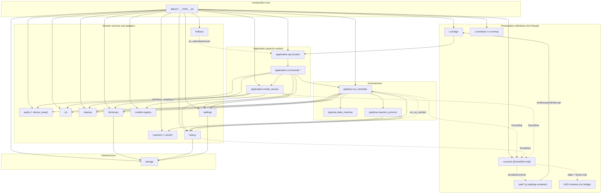
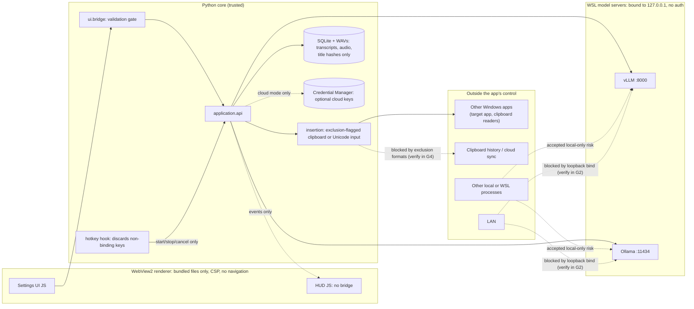

# Wispr Clone — Visual Code Map

Status: **planning only**. These diagrams are drawn from the "Contracts and dependency direction" tables in [CODEMAP.md](CODEMAP.md) §3 and the webview/clipboard/model-server rules in §4, §6 and §7. They do not describe working code.
Solid arrows mean "imports / calls". Dashed arrows are **injected callbacks** wired by `app.py`: the producer calls an interface and never imports the consumer, so they add no import edge.

## 1. Module dependency graph (layers, top → bottom)

Shared leaves (`contracts/`, `config`, `util`) are left out of the arrows because any module may import them and they import nothing above themselves.

**Cycle check** (a topological sort of the solid edges, run as a planning check with Python's `graphlib`): the import graph is **acyclic**. Adding the dashed callbacks as runtime calls leaves exactly one loop: `run → history → on_run_evicted → run`. CODEMAP §3 breaks it by delivering every callback asynchronously on the worker loop, never re-entrantly.

## 2. Fan-in / fan-out summary

| Module | Fan-out (imports) | Fan-in (imported by) | Note |
|---|---|---|---|
| `contracts/*` | 0 | many, split across 4 small files | A type enters only when ≥2 packages outside its owner need it |
| `app.py` | ~all | 0 | Expected for a composition root |
| `application.api` | 1 (commands) | 1 (bridge) | Thin router only |
| `application.commands.*` | 1–2 each | 1 (api) | One handler per command group |
| `pipeline.run_controller` | 7 | 2 (commands, app) | Orchestrator; insertion sequence delegated to `insertion_protocol` |
| `pipeline.insertion_protocol` | 2 | 1 | Sole owner of claim → dispatch → outcome |
| `history` | 1 + sink/callback | 4 (commands, run, protocol, app) | Highest domain fan-in, each caller using a distinct part of its interface |
| `storage` | 0 | 3 (dictionary, history, settings) | Healthy |
| `audio` | 0 | 3 (commands, run, app) | Device lease enforces one owner |

## 3. Trust boundaries and sensitive data

