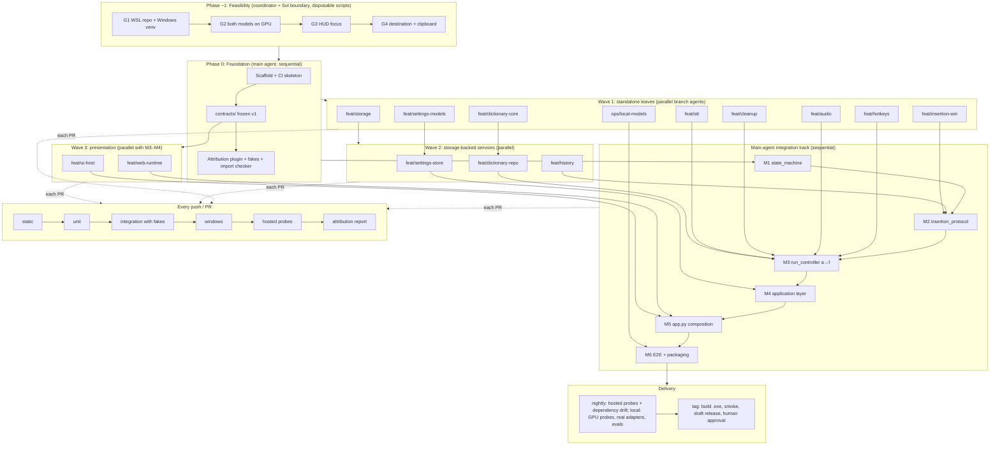
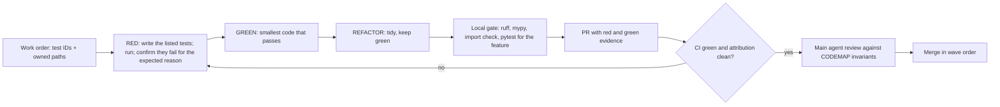
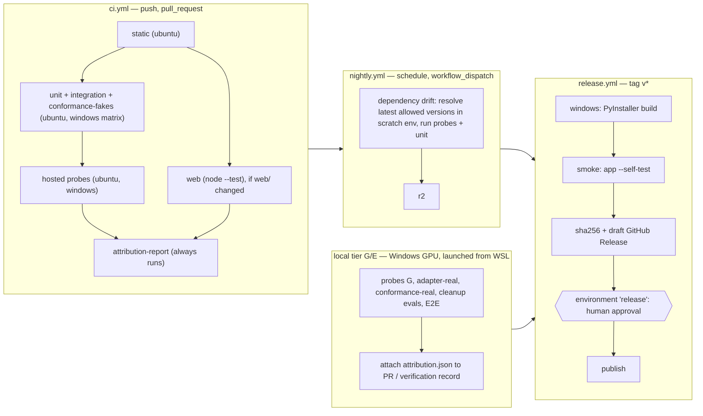
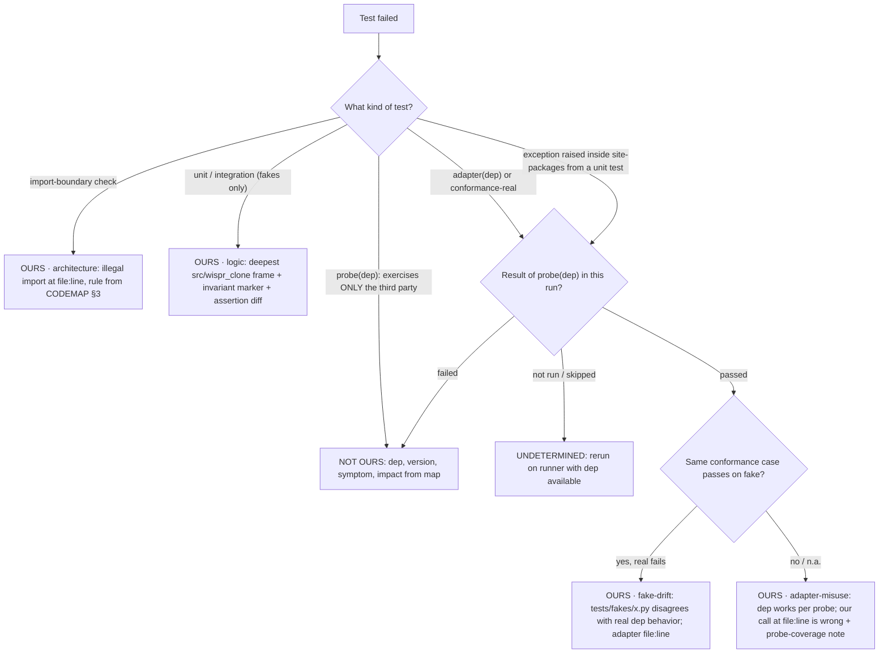
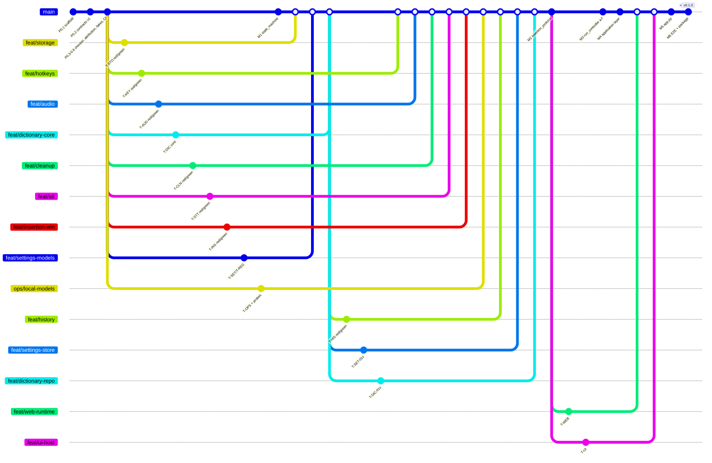

# Wispr Clone — Backend Development Pipeline (CI/CD + TDD + parallel agents)

Status: **planning only**. This document plans how the backend in [CODEMAP.md](CODEMAP.md) gets built, tested, integrated and delivered. No workflow, test or source file exists yet. Every test ID below is **planned**. None has been written or run.

| Read in order | Question answered |
|---|---|
| 1. Pipeline at a glance | What is the whole picture? |
| 2. Ground rules | How does one feature move from test to merge? |
| 3. What AI agents can and cannot do here | What steps can an agent take without a human? |
| 4. CI/CD design | What runs, where, and when? |
| 5. Failure attribution: our code or someone else's | How does a failing test say who is at fault? |
| 6. Feature plan and replicable test catalogue | What gets built, in what order, and how is each piece proven? |
| 7. Branch plan for parallel agents | Who works on what at the same time? |
| 8. Main-agent integration track | What must be done by the agent that controls merging? |
| 9. Prerequisites, decisions and first steps | What must happen before step one? |

**Sources of truth:** product behavior comes from the [feature spec](../research/voice-dictation-features.md). Module boundaries come from [CODEMAP.md](CODEMAP.md) §3, run rules from §4, and data rules from §5. Package choices come from [DEPENDENCIES.md](DEPENDENCIES.md). If this pipeline conflicts with those documents, they win and this file gets corrected.

---

## 1. Pipeline at a glance



**In one sentence:** disposable feasibility checks prove the host and model plan first, then the main agent builds the frozen foundation. Branch agents then build standalone pieces in parallel, test-first, while the main agent builds the state machine. The main agent then does all cross-cutting integration. Every change passes the same CI, and every failure is labeled **OURS**, **NOT OURS** or **UNDETERMINED**.

---

## 2. Ground rules

### 2.1 One feature, test-first (red → green → refactor)



- **One feature per PR.** A feature is one row in §6. If a PR needs code outside its owned paths, stop and file a *contract change request* (§7.3) instead.
- **Commit shape:** `test(T-HIS-002): expiry at exactly 24h` (red), then `feat(history): …` (green), then optional `refactor(history): …`. The PR description pastes the red failure output, showing that the test failed for the right reason, and the green run.
- **Definition of Done for any feature:**
  1. Every test ID in the work order exists, carries its ID in its name, and passes.
  2. The import-boundary check passes.
  3. Adapter features include their third-party probes and impact-map fragment (§5).
  4. There are no new dependencies beyond the approved baseline.
  5. There are no skipped tests without a stated reason marker.
  6. CI is green.
- **A flaky test is a bug.** Quarantine (`@pytest.mark.quarantine(issue=…, since="YYYY-MM-DD")`) is allowed for at most 7 days and never for a core invariant test. The attribution plugin fails collection when a quarantine is older than 7 days (T-DIAG-007), so CI enforces the limit (§4.2 triage automation).

### 2.2 What "replicable" means for every core test

| Rule | How it is enforced |
|---|---|
| Stable ID | Test function name contains the ID (`test_T_HIS_002_expires_at_exact_24h`), so `pytest -k T_HIS_002` always reproduces it |
| No wall-clock time | Inject `FakeClock`; no `time.sleep`; asyncio tests drive the loop explicitly |
| No randomness | Seeded generators; UUIDs injected via a factory in tests |
| No real devices or servers in core tests | Fakes from `tests/fakes/`; real boundaries only in `probe`/`adapter` tests |
| Committed fixtures | Small WAVs and canned server transcripts in `tests/fixtures/`, each with a source/licence note |
| Printed reproduce line | The attribution report prints the exact command for every failure (§5.5) |
| Same result on Linux and Windows | Pure/fake tests run on both hosted OSes in CI |

### 2.3 Branching model

- `main` is protected: PR only, required checks, linear history, no force-push. It must always build.
- Short-lived branches: `feat/<area>`, `ops/<area>`, `main/<Mx>` (main-agent integration), `fix/<test-id>`.
- Each **branch** has one **git worktree**, for example `git worktree add ../wc-storage feat/storage`. Sol and Luna take turns in it (RED → GREEN → verify is sequential), so there are never two writers at once and no commits move between worktrees.
- The Sol agent that verifies GREEN pushes the branch and opens the PR with `gh pr create` (agents/README.md, dispatch step 5).
- Merge order follows the waves. Branch agents never merge. Only the main agent merges, after review.

---

## 3. What AI agents can and cannot do here

Based on this machine: WSL2 Ubuntu, RTX 5080 visible to WSL, Node 22 and `gh` 2.101.0 installed, `shellcheck` not installed, no passwordless `sudo`.

| Step | Agent can do it alone | Needs a human decision or action | Why |
|---|---|---|---|
| Write tests, code, CI YAML, scripts | ✅ | — | Ordinary repository edits |
| Run pure/fake tests, ruff, mypy, import checker in WSL | ✅ | — | Linux-safe, no side effects |
| Run `node --test` for `web/` | ✅ | — | Node 22 is present; no npm packages needed |
| Run Windows-only tests (pywin32, clipboard, hooks) | ⚠️ Partly: via hosted `windows-latest` CI, or Windows `uv.exe` through WSL interop | Human confirms interop use | Hosted runners have no interactive desktop, so focus and insertion cannot be proven there |
| Create worktrees and local branches, commit | ✅ once the user authorizes commits | Authorization | Commits are the user's call |
| Push branches and open PRs | ✅ via `gh` | — (authorized 2026-09-24) | The repo is public, so everything pushed is visible |
| Merge to `main` | ✅ main agent only, after green CI + review | — (authorized 2026-09-24) | Shared history. Branch agents never merge |
| Download models, or load/unload/reconfigure models in LM Studio | ❌ without approval | User approves; both selected models are already in LM Studio (DEPENDENCIES.md) | Cognee depends on LM Studio's loaded models; changing them can break its memory |
| Run GPU probes and real-adapter tests | ✅ locally; results attached to PRs | — (decided 2026-09-24) | Runs on the Windows GPU through `uv.exe` from WSL; hosted CI has no GPU |
| Verify HUD non-activation, real-app insertion, Win+V exclusion, mic unplug | ❌ | Human manual checklist (tier H, §4.1) | Needs a real desktop, real apps and physical hardware |
| Publish a release | ❌ | Human approves the `release` environment | Outward-facing |
| Add a dependency outside DEPENDENCIES.md | ❌ | User approves after a dependency note | Global rule |

**Agent operating limits:** no secrets in the repo, logs or test output. No transcripts, audio or keystrokes in logs. Tier G results are generated locally and attached, never uploaded with transcripts or audio. No LAN exposure of LM Studio to "fix" connectivity.

---

## 4. CI/CD design

All workflows run on GitHub Actions for `github.com/June74/wispr_clone` with `working-directory: backend_dev`. Python 3.12 via `uv` uses the locked environment (`uv sync --locked`), so CI tests exactly the lockfile.

### 4.1 Test tiers and where they run

| Tier | Marker(s) | Runner | Trigger | What it proves |
|---|---|---|---|---|
| **S** static | — | `ubuntu-latest` | every push/PR | ruff lint+format, mypy, import-boundary check |
| **U** unit | `unit` | `ubuntu-latest` + `windows-latest` | every push/PR | Pure logic and invariants, with fakes only |
| **I** integration | `integration` | `ubuntu-latest` + `windows-latest` | every push/PR | Multiple modules wired with fakes; crash/restart with a real SQLite file |
| **C** conformance | `conformance` | ubuntu (fakes) / GPU (real) | PR (fakes) / nightly (real) | Fakes and real adapters pass the same contract suite, so fakes cannot drift |
| **W** windows | `windows` | `windows-latest` | PR touching `insertion/ hotkeys/ ui/ audio/ stt/`, plus nightly | pywin32 clipboard formats, SendInput builders, sqlite on NTFS paths, transcribe.cpp wheel imports and CPU backend loads (P-TCPP-001), packaging smoke |
| **P** hosted probes | `probe` and not `gpu` | ubuntu + windows | every PR + nightly | Third-party libraries behave as our code assumes |
| **G** local GPU | `gpu`, `adapter` | this machine's Windows GPU, launched from WSL with the Windows venv (`uv.exe`), run by Sol boundary | each M-step PR touching adapters, pre-release | transcribe.cpp/Voxtral on CUDA, LM Studio/Llama, loopback-only checks, G6 cleanup evals |
| **E** end-to-end | `e2e` | same as G, run by Sol boundary | pre-release | Fixture WAV → real STT → real cleanup → fake or real inserter |
| **H** human | `manual` checklist | the user's desktop | pre-release | HUD focus, real apps, Win+V history, mic unplug (CODEMAP G3/G4) |
| **J** web | `node --test` | `ubuntu-latest` | PR touching `web/` | JS renders backend state; no mock control paths |

### 4.2 Workflows



**Required checks on `main`:** `static`, `unit (ubuntu)`, `unit (windows)`, `probes (ubuntu)`, `probes (windows)`, `attribution-report`, and `web` when applicable. GPU tiers are **not** required on PRs, since the runner may be offline. They are required before a release tag (§4.3).

**Triage automation (GitHub Actions, decision 2026-09-24).** Actions detects maintenance work; the coordinator decides the response:

| Signal | Automation | Coordinator response |
|---|---|---|
| `nightly.yml` fails (dependency drift or hosted probes) | The job opens or updates one GitHub issue labelled `triage` with the attribution summary (`gh issue create/comment`, `permissions: issues: write`) | Issue a `fix/<test-id>` work order (Sol RED → Luna GREEN) or pin the dependency |
| A quarantine is older than 7 days | Collection fails in `ci.yml` (T-DIAG-007) | Fix the test or the code; a quarantine is never extended silently |
| Release tag | `release.yml` drafts the release; the tier H checklist goes in `docs/verification/<version>.md` | Coordinator fills the record with the user; the user approves `release` |

Actions cannot write fixes. It only makes the work visible.

### 4.3 Continuous delivery (the "CD" part)

For a desktop app, **CD means continuous delivery, not automatic deployment.** Every green `main` has a buildable artifact, and a release needs a human click:

1. On every merge to `main`: `windows-latest` builds the PyInstaller executable, runs `wispr_clone.exe --self-test`, and uploads it as a 7-day workflow artifact. The self-test composes the app with fakes, runs migrations on a temp dir and exits 0.
2. On tag `vX.Y.Z`: rebuild, re-run the self-test, record SHA-256, and create a **draft** release.
3. The release gate needs all of these: a local tier G/E report for the tag commit attached to the verification record, the tier H checklist recorded in `docs/verification/<version>.md` (template: `ai-dev-system/templates/verification.md`), and a human approval on the `release` environment.
4. Rollback: the previous release stays published. Users reinstall it. No database migration may be destructive without a backup step (CODEMAP §5).

### 4.4 Self-hosted GPU runner safety (not used: tier G runs locally, decision 2026-09-24)

Keep these rules if a runner is ever added. The repo is public, and a self-hosted runner executes whatever code a workflow runs. So:

- Tier G/E jobs would trigger only on `schedule`, `workflow_dispatch` and `push` to `main`, **never on `pull_request`**.
- The runner would run as an unprivileged WSL user with no stored cloud credentials.
- LM Studio serves on `127.0.0.1` only. Probe `P-NET-002` fails the run if it is reachable on the LAN IP.

### 4.5 Tooling this pipeline adds (dependency note)

| Tool | Why | Where | Cost / alternative | If removed |
|---|---|---|---|---|
| GitHub Actions (hosted) | Runs CI on Linux and Windows | `.github/workflows/` at repo root | Free minutes on public repos, metered on private; alternative: local-only `scripts/ci-local.sh` | No automatic gates; the agent must run checks manually |
| `mypy` (already optional in DEPENDENCIES.md) | Type checks shared contracts | `pyproject.toml` dev group | Chosen over pyright to match `ai-dev-system/templates/checks.python.json` | Weaker contract safety |
| `pytester` (built into pytest) | Tests the attribution plugin itself | none | none | — |
| `node:test` (built into Node 22) | `web/` tests without npm packages | none | vitest/jest would add a lockfile | No web tests |

No coverage package is added. Invariant-based test IDs are the coverage measure here. Coverage can be proposed later if gaps appear.

---

## 5. Failure attribution: our code or someone else's

**Requirement:** every failing test states plainly whether the fault is in our code (with *where* and *why*) or in a third party (with *which* software, *which version*, and *which of our areas and user features it affects*).

### 5.1 Three verdicts

| Verdict | Meaning | Always reports |
|---|---|---|
| **OURS** | Our code violates an invariant or misuses a dependency that behaves correctly | file:line, function, violated invariant (CODEMAP section), observed vs expected, category (`logic`, `contract`, `architecture`, `adapter-misuse`, `fake-drift`) |
| **NOT OURS** | A third-party library, service or platform does not behave as its probe expects | dependency name and kind (`library`, `service`, `platform`), installed version, failing probe ID and symptom, affected modules, affected user features, user-visible ErrorCode, suggested non-code action |
| **UNDETERMINED** | The deciding probe could not run on this runner (no GPU, no audio device, no desktop) | which probe is missing and which runner can decide |

UNDETERMINED is deliberately explicit. A skipped probe never gets rounded to OURS or NOT OURS.

### 5.2 How the verdict is decided



Key idea: **probes isolate the third party.** A probe calls the library or service directly with no `wispr_clone` code on the stack. If the probe passes and our adapter fails, the fault is ours. If the probe fails, it is not ours, whatever our adapter did.

**Probe coverage caveat.** "Probe passed" means only that the third party did what the probe checks. An adapter-misuse verdict therefore also lists which probe cases passed, for example: `probe coverage: P-LMS-001..003 (models, temp-0 chat, cancel); streaming not probed`. If investigation shows the adapter relied on third-party behavior no probe checks, the fix adds that probe case first. On rerun the verdict either stays OURS (the dependency does behave that way) or becomes NOT OURS (it doesn't). The label stays evidence-based instead of being reassigned by opinion.

### 5.3 Mechanics (Phase 0, main agent)

| Piece | Location | Role |
|---|---|---|
| Markers | `pyproject.toml [tool.pytest.ini_options]` | `unit`, `integration`, `conformance`, `probe(dep)`, `adapter(dep)`, `windows`, `gpu`, `e2e`, `manual`, `feature(name)`, `invariant(text)`, `quarantine(issue)` |
| Attribution plugin | `tests/_attribution/plugin.py`, registered in `tests/conftest.py` | `pytest_collection_modifyitems` runs probes first. `pytest_runtest_makereport` classifies each failure: it walks the traceback for the deepest `src/wispr_clone` frame and the deepest `site-packages` frame, maps the module to its distribution via `importlib.metadata.packages_distributions()` and the version via `importlib.metadata.version()`, then applies §5.2 |
| Boundary exceptions | `contracts/common.py` | Adapters wrap every third-party exception as `ThirdPartyError(dependency, operation, detail, error_code)`. Our own invariant failures raise `WisprError(error_code, where, why)`. Runtime logs benefit too, carrying the ErrorCode and dependency but never transcripts |
| Impact map fragments | `tests/_attribution/impact/<dep>.toml`, **one file per dependency**, owned by the branch that adds the adapter | `dep → our modules → user features → ErrorCodes → suggested action`. One file each avoids merge conflicts between parallel branches |
| Impact map sync test | `T-DIAG-006` | Parses `src/` imports with `ast`. Every third-party import must appear in a fragment naming that module, and every fragment module must really import it, so the map cannot rot |
| Cross-job merge | `attribution-report` job | Merges each job's `attribution.json` so a GPU probe result from nightly can resolve an UNDETERMINED from the same commit. Writes the summary to `$GITHUB_STEP_SUMMARY` |

Example impact fragment:

```toml
# tests/_attribution/impact/transcribe_cpp.toml
dependency = "transcribe-cpp"  # kind: library (in-process, CUDA) running Voxtral-Mini-4B-Realtime-2602 Q4_K_M GGUF
kind = "library"
modules = ["stt.voxtral_transcribe_cpp", "pipeline.run_controller (via stt.base)", "application.model_service (health)"]
features = ["live dictation", "retry_stt from saved WAV", "Models page: test / readiness"]
error_codes = ["STT_UNAVAILABLE", "STT_MODEL_LOAD_FAILED", "STT_TIMEOUT"]
action = "Check the transcribe-cpp wheel pin in uv.lock, the GGUF SHA-256 (scripts/check_local_models.py) and free VRAM; not a wispr_clone code fix"
```

### 5.4 Third-party probe catalogue

| Probe ID | Dependency (kind) | Tier | Checks exactly what our code assumes |
|---|---|---|---|
| P-SQLITE-001..004 | SQLite C library via `sqlite3` (library) | P | Version; WAL mode persists; `UNIQUE` violation raises `IntegrityError`; `ON DELETE CASCADE` works with `PRAGMA foreign_keys=ON` |
| P-NUMPY-001 | numpy (library) | P | FFT band energies of a known sine land in the expected bin |
| P-SOXR-001 | soxr (library) | P | 48 kHz → 16 kHz keeps length ratio and tone frequency |
| P-SD-001 | sounddevice / PortAudio (library + OS audio) | P→**UNDETERMINED in CI** | Import works; `query_devices()` returns a list; opening default input needs a device (tier H) |
| P-HTTPX-001 | httpx (library) | P | Timeout raises `httpx.TimeoutException`; cancel closes the stream |
| P-PYD-001 | pydantic (library) | P | Strict-mode validation rejects extra/invalid fields as our schema assumes |
| P-PYNPUT-001 | pynput (library + OS hook) | W | Listener starts/stops without an exception; synthetic events may be UNDETERMINED on headless runners |
| P-WIN32-001..003 | pywin32 + Windows clipboard (library + platform) | W | `RegisterClipboardFormat` for the 3 exclusion formats; set/get round trip; `SendInput` symbol available |
| P-WEBVIEW-001 | pywebview (library) | W | Window object can be created with `js_api=None`; real display is tier H |
| P-TCPP-001 | transcribe-cpp wheels (library) | W | Imports on `windows-latest`; `backends()` lists a CPU device; the ABI/version check passes |
| P-TCPP-002..004 | transcribe-cpp + Voxtral GGUF on CUDA (library + model) | G | 002: model loads on CUDA, reports streaming, warm-up completes; 003: 80 ms `feed()` chunks at live pace never fall behind and `finalize()` returns committed text; `session.cancel()` raises `Aborted` within a bound set from the first measured run; 004: public-domain LibriVox fixture → formatting-normalized word error rate under a threshold set from the first measured run |
| P-LMS-001..003 | LM Studio + Llama 3.1 8B (service) | G | 001: `/v1/models` lists the pinned model id as loaded; 002: chat at temperature 0 returns non-empty and identical output on repeat; 003: client disconnect stops generation |
| P-NET-001/002 | Loopback (platform) | G | LM Studio reachable on `127.0.0.1:1234`; LAN IP **not** reachable |
| P-GPU-001 | NVIDIA driver/CUDA on Windows (platform) | G | `nvidia-smi` sees the GPU; free VRAM recorded with every tier G result |
| P-UIA-001..003 | Windows UI Automation (platform) | W→H | 001: the focused field's identity can be read from Notepad, VS Code and Chrome; 002: a Chrome/Edge tab can be reselected by UIA; 003: focus can be restored to a field by its identity. Hosted CI has no desktop, so real results come from Phase −1.4 and tier H |
| P-PYI-001 | PyInstaller (library) | W | Build of a hello-world bundle with pywebview assets launches |

### 5.5 What a failure looks like

Code-native:

```text
[ATTRIBUTION] OURS · logic
  test:       T-PRO-004 duplicate request_id cannot dispatch twice
  reproduce:  uv run pytest tests/integration/pipeline/test_insertion_protocol.py -k T_PRO_004
  where:      src/wispr_clone/pipeline/insertion_protocol.py:88 in attempt()
  invariant:  at most one automatic dispatch per run (CODEMAP §4 step 1)
  why:        FakeInserter.dispatch called 2 times, expected 1; second call reached dispatch
              because claim() result was not checked before recheck_destination()
  evidence:   P-SQLITE-002 (UNIQUE raises IntegrityError) PASSED -> SQLite behaved correctly
```

Third-party:

```text
[ATTRIBUTION] NOT OURS · service
  source:     LM Studio 0.x.y serving meta-llama-3.1-8b-instruct (Windows, 127.0.0.1:1234)
  probe:      P-LMS-001 /v1/models -> FAILED: pinned model listed but state "not-loaded" (idle auto-unload?)
  our code:   conformance suite on FakeCleanup PASSED; cleanup.lmstudio_cleanup follows the documented contract
  affects:    cleanup.lmstudio_cleanup -> pipeline.run_controller -> application.model_service
  features:   cleanup after dictation, retry cleanup, Models page test button
  user sees:  run waits in awaiting_cleanup_choice (original kept), ErrorCode CLEANUP_UNAVAILABLE
  action:     load the model in LM Studio or check its idle-unload setting; not a wispr_clone code fix
```

Undetermined:

```text
[ATTRIBUTION] UNDETERMINED
  test:       T-STT-A01 adapter transcribes fixture WAV
  missing:    P-TCPP-002..003 not run on ubuntu-latest (marker gpu)
  decide by:  uv.exe run pytest -m "probe and gpu" -k TCPP   (Windows venv on the local GPU machine)
```

The attribution system is itself built test-first (Phase 0, `T-DIAG-*`) with `pytester`. The meta-tests feed it synthetic failures and assert that it produces the right verdict. It is a triage aid, not a guarantee. A NOT OURS verdict means "the third party failed its probe", not "our code is proven correct everywhere".

---

## 6. Feature plan and replicable test catalogue

Features grow from small pure pieces to connected orchestration. Test IDs are planned. Each line is a behavior the test must assert. **Bold** IDs are core invariants that can never be quarantined.

### Phase −1: Feasibility (coordinator + Sol boundary, blocks Phase 0)

CODEMAP slice 0. Disposable scripts under `experiments/` (never imported by `src/`, not merged as product code). Each check ends with a result recorded in the CODEMAP gate table. A failed check triggers the CODEMAP decision rule (§7 "Decision rule") before P0 starts. These checks do not need the P0 scaffold.

| # | Gate | Check | Exit evidence |
|---|---|---|---|
| −1.1 | G1 runtime location (**decided:** WSL repo + Windows-local venv) | Windows Python 3.12 + `uv.exe` creates a venv on the Windows disk (`UV_PROJECT_ENVIRONMENT=%LOCALAPPDATA%\wispr_clone\venv`) for the checkout at `\\wsl.localhost\<distro>\home\injun\projects\wispr_clone\backend_dev`; import pywin32, pynput, sounddevice, pywebview; run a trivial pytest | Commands, versions and timings recorded; path or performance problems noted |
| −1.2 | G2 inference (**decided:** transcribe.cpp in-process + LM Studio) | Done 2026-09-24: Voxtral via transcribe.cpp on CUDA with synthetic speech (CODEMAP §7 record). Remaining: LM Studio chat at temperature 0, cancel on disconnect, loopback-only, request logging; real-microphone dictation; STT while LM Studio generates | Free VRAM before and after, peak usage, latency; LAN IP unreachable; no transcript text in LM Studio's logs |
| −1.3 | G3 native UI | A disposable pywebview HUD shows, updates and hides without taking focus from Notepad and VS Code | Observed focus result per app (human-observed, tier H style) |
| −1.4 | G4 destination + hybrid delivery | Capture window + tab + field identity; switch away; idle jump back (bring window forward, reselect tab, restore field focus), insert once, restore the user's window; return trigger; clipboard with the 3 exclusion formats; Win+V check | Per app (Devin desktop, including switching inside Devin; Notepad; VS Code; a Chrome/Edge tab): jump allowed? field restored? inserted once? user's window restored? Jump duration; Win+V exclusion observed |

### Phase 0: Foundation (main agent, sequential, blocks everything)

| # | Feature | Owned paths | Tests (write first) |
|---|---|---|---|
| 0.1 | Scaffold | `pyproject.toml`, `uv.lock`, `.python-version`, `tests/conftest.py`, `.github/workflows/ci.yml` (static + unit only) | T-CI-001 trivial test collected and passes on ubuntu and windows; T-CI-002 all markers registered (unknown marker = error via `--strict-markers`) |
| 0.2 | Contracts v1 | `contracts/common.py, events.py, run.py`, `config.py`, `util/error_messages.py` | **T-CON-001** `Result` is exactly one of ok/error; **T-CON-002** every `ErrorCode` has a message and recovery actions (exhaustive); T-CON-003 every event payload JSON-serializes with data-only types; T-CON-004 `ThirdPartyError` carries dependency + operation; T-CON-005 `RunStatus`/`AttemptOutcome` values match CODEMAP §4/§5 |
| 0.3 | Import-boundary checker | `scripts/check_imports.py`, `tests/arch/` | **T-ARCH-001** import graph acyclic (`graphlib`); **T-ARCH-002** each module imports only its CODEMAP §3 allowed deps (a seeded bad import in a temp tree reports file:line); T-ARCH-003 `contracts/`, `config`, `util` import nothing above them |
| 0.4 | Attribution plugin | `tests/_attribution/` | T-DIAG-001 fake-only failure → OURS with src frame; T-DIAG-002 failing probe → NOT OURS with version; T-DIAG-003 adapter fail + probe pass → OURS adapter-misuse; T-DIAG-004 probe skipped → UNDETERMINED; T-DIAG-005 report prints reproduce command; T-DIAG-006 impact map in sync with imports; T-DIAG-007 a quarantine older than 7 days fails collection |
| 0.5 | Shared fakes + conformance harness | `tests/fakes/`, `tests/conformance/` | T-FAKE-001 `FakeClock` advances deterministically and fires scheduled callbacks in order; T-FAKE-002 `FakeEventSink` records events in order; conformance suites defined (empty) for STT, cleanup, inserter, audio source |
| 0.6 | Full CI skeleton | `.github/workflows/ci.yml, nightly.yml, release.yml` | CI runs all tiers on an empty suite and `attribution-report` renders "0 failures" |

`contracts/shortcuts.py` is left as a named, empty module. Branch `feat/hotkeys` fills it (§7.2).

### Wave 1: standalone leaves (parallel branch agents, plus M1 by the main agent)

| Branch | Feature (CODEMAP) | Key tests (IDs → assertion) | Probes owned |
|---|---|---|---|
| `feat/storage` | `storage/db.py`, `migrations/` | T-STO-001 migrations apply in order and re-run is a no-op; T-STO-002 WAL on after open; **T-STO-003** concurrent writes from two tasks are serialized by the single writer; T-STO-004 foreign keys on, so cascade works; T-STO-005 a failing migration rolls back to the prior version | P-SQLITE-* |
| `feat/hotkeys` | `contracts/shortcuts.py`, `hotkeys/hotkey_service.py` | T-KEY-001 parse valid bindings, reject malformed/conflicting ones; T-KEY-002 hold mode: down→start, up→stop; T-KEY-003 toggle mode; T-KEY-004 cancel binding; **T-KEY-005** non-binding keys are discarded: no log record, no buffer, no callback; T-KEY-006 OS key auto-repeat does not restart a run | P-PYNPUT-001 |
| `feat/audio` | `audio/*` incl. `device_lease.py` | **T-AUD-001** lease is exclusive (capture vs mic test) and returns a conflict error; T-AUD-002 lease released on error/cancel; T-AUD-003 resample keeps duration and tone; T-AUD-004 level meter bands for a known sine; T-AUD-005 WAV header valid after cancel; **T-AUD-006** queue overflow ends the run with an explicit error, never a silent drop; T-AUD-007 the audio callback only enqueues (no I/O in the callback) | P-NUMPY, P-SOXR, P-SD |
| `feat/dictionary-core` | `dictionary/apply.py`, `import_export.py` (pure parts) | T-DIC-001 whole-word alias replacement; **T-DIC-002** no replacement inside unrelated phrases; T-DIC-003 overlapping aliases, longest match deterministic; **T-DIC-004** input string never mutated (original preserved); T-DIC-005 import validates the whole input before accepting and reports duplicates; T-DIC-006 conflicting aliases rejected; T-DIC-007 export→import round trip | — |
| `feat/cleanup` | `cleanup/prompt_builder.py, guard.py, lmstudio_cleanup.py` (OpenAI-compatible chat) | T-CLN-001 prompt has glossary + instructions, never history; **T-CLN-002** guard rejects a dropped negation ("Do not delete that file"); **T-CLN-003** guard rejects changed numbers, names, paths, identifiers; T-CLN-004 guard rejects added content or an answer to a spoken question; T-CLN-005 timeout → `ThirdPartyError(lmstudio, "chat", …)`; T-CLN-006 cancel aborts the in-flight request; T-CLN-007 "model not loaded" from LM Studio → `ThirdPartyError`, never a silent empty cleanup; conformance suite on fake and real | P-HTTPX-001 (P-LMS-* owned by `ops/local-models`) |
| `feat/stt` | `stt/base.py, voxtral_transcribe_cpp.py` (fake `transcribe_cpp` module in tests) | T-STT-001 model loads and warms up once at startup before the first run is accepted; T-STT-002 chunks are fed in order on the STT thread, never on the worker loop; T-STT-003 finish calls `finalize()` and returns committed text only (tentative text is never stored as final); T-STT-004 native error → `ThirdPartyError(transcribe-cpp, …)`; **T-STT-005** cancel calls `session.cancel()` and late updates are ignored; T-STT-006 `transcribe_file` replays a WAV exactly like live input; T-STT-007 a second session while one runs is rejected (one run per model); T-STT-A01 (tier G) real adapter transcribes the fixture | P-TCPP-001 (P-TCPP-002..004 owned by `ops/local-models`) |
| `feat/insertion-win` | `insertion/*` | **T-INS-001** destination snapshot stores a title hash, never the title; T-INS-002 verifier reports change on handle/process change; **T-INS-003** matching title hash alone is not sufficient; **T-INS-004** every transcript clipboard write sets the 3 exclusion formats; **T-INS-005** strategy fixed before dispatch, and ambiguous paste never falls back to typing; T-INS-006 Unicode `SendInput` event builder is correct (pure); T-INS-007 snapshot records window, tab and field UI Automation identity (fake UIA tree); T-INS-008 bring-forward and restore calls target the captured window/tab and the user's previous window/tab (fake Win32); **T-INS-009** after dispatch, read-back mismatch or unreadable field → `uncertain`, never `inserted`; **T-INS-010** active IME in the target thread selects exclusion-flagged paste over Unicode typing; T-INS-011 typing waits for the settle after bring-forward | P-WIN32-*, P-UIA-* |
| `feat/settings-models` | `settings/schema.py`, `models/registry.py` | T-SET-001 defaults validate; T-SET-002 invalid shortcut rejected via the shortcuts contract; **T-SET-003** local-only forbids selecting a cloud model; T-SET-004 older schema version upgrades; T-REG-001 registry lists selected models with local flags; **T-REG-002** local endpoints must be loopback | P-PYD-001 |
| `ops/local-models` | `scripts/check_local_models.py` | T-OPS-001 missing GGUF or SHA-256 mismatch → clear error naming the expected path; **T-OPS-002** LM Studio reachable on the LAN IP → reported as a failure, never a warning; T-OPS-003 LM Studio not running / model not loaded / ready → three distinct statuses (fake HTTP); T-OPS-004 the check reads no credentials and downloads nothing (static) | P-TCPP-002..004, P-LMS-*, P-NET, P-GPU (sole owner of all real-model checks and the `lmstudio` impact fragment) |
| **main: M1** | `pipeline/state_machine.py` | see §8 | — |

### Wave 2: storage-backed services (parallel; start when `feat/storage` merges)

| Branch | Feature | Key tests |
|---|---|---|
| `feat/settings-store` (needs settings-models) | `settings/store.py` | T-SET-010 persist and reload; T-SET-011 corrupted row → back up the settings row only, then defaults; T-SET-012 patch validated atomically (all or nothing) |
| `feat/dictionary-repo` (needs dictionary-core) | `dictionary/repo.py` + persistence of import/export | T-DIC-010 CRUD round trip; T-DIC-011 unique normalized spelling; T-DIC-012 invalid import leaves the DB unchanged; **T-DIC-013** dictionary survives history `delete_all` |
| `feat/history` | `history/repo.py, retention.py` | **T-HIS-001** eleventh run evicts the oldest and fires `on_run_evicted`, *deferred* on the loop and not re-entrant; **T-HIS-002** expiry at exactly `created_at == now−24h`; **T-HIS-003** view/copy/retry never renews age; **T-HIS-004** expiry enforced before list/get/copy/recover; T-HIS-005 WAV delete failure → hidden pending-deletion task with no transcript, retried at startup; T-HIS-006 startup removes unreferenced WAVs; **T-HIS-007** at most one automatic attempt per run (UNIQUE); **T-HIS-008** duplicate `request_id` deduplicated; **T-HIS-009** insertion outcome derived from the latest attempt only; **T-HIS-010** restart turns `in_flight` into `uncertain`; **T-HIS-011** restart turns `pending` cleanup into `failed` + `awaiting_cleanup_choice`; **T-HIS-012** manual delete removes audio and both transcript versions and cascades attempts; **T-HIS-013** `original_text` immutable after first write |

### Wave 3: presentation (parallel with M3–M4; contracts frozen, so fakes stand in for the application)

| Branch | Feature | Key tests |
|---|---|---|
| `feat/web-runtime` | `web/*` ported from the finished UI in `../ui_development/code/` (`index_final.html`, `styles_final.css`, `app_final.js`, `waveform_final.js`, `assets/geist.ttf` + `OFL-Geist.txt`), with mock paths removed (CODEMAP §6 table). `ui_development/` stays read-only; `../ui_development/screenshots/` is the appearance reference | T-WEB-001 no mock history/dictionary arrays or simulated timers remain (static); **T-WEB-002** no `getUserMedia`, so the waveform takes backend levels only; T-WEB-003 renders the `state_get` snapshot; **T-WEB-004** "inserted" toast only on a confirmed backend outcome event; **T-WEB-005** failed cleanup shows retry / use original / copy / cancel and no insertion toast; T-WEB-006 reconnect calls `state_get` and never replays mutations; T-WEB-007 only green animates, blue/yellow/red stationary |
| `feat/ui-host` | `ui/bridge.py, events.py, windows.py, overlay.py` (fake webview module in unit tests) | **T-UI-001** bridge rejects unknown and malformed commands; T-UI-002 event serializer is data-only (no code interpolation); **T-UI-003** HUD window created with no `js_api`; **T-UI-004** navigation to non-bundled URLs blocked, CSP set; T-UI-005 release config has `debug=False`, no HTTP server |

### Main-agent integration track (M1–M6)

See §8. These are the features that need several merged branches at once.

### Acceptance mapping (feature spec → proving tests)

| Feature-spec acceptance check | Proven by |
|---|---|
| Both trigger modes; cancel inserts nothing | T-KEY-002/003, T-RUN-002..004, E2E-001, H-01 |
| Only green bars animate | T-WEB-007, H-02 |
| Pauses do not end recording | T-RUN-006, E2E-002 |
| Cleanup keeps negation, numbers, names, terms | T-CLN-002/003, EVAL-G6 (tier G) |
| Switch away → text reaches the original field exactly once (idle jump or return), never the current window | T-PRO-003, T-PRO-009..015, T-RUN-020, H-03 |
| Nothing inserted while the user is typing elsewhere; user returned to their window | T-PRO-010, T-PRO-011, H-03 |
| Closed/unverifiable destination holds the text | T-PRO-013, T-INS-002 |
| Failed/uncertain insertion → no automatic duplicate | T-PRO-004/005/006, T-HIS-010 |
| Cleanup failure keeps original | T-RUN-010/011, T-HIS-013 |
| Offline after model setup | E2E-003 (network disabled), P-NET-002 |
| 11th run removes oldest; 24h expiry | T-HIS-001/002 |
| Manual delete removes audio + both transcripts, keeps settings/dictionary | T-HIS-012, T-DIC-013 |

---

## 7. Branch plan for parallel agents

### 7.1 Timeline



**Concurrency (decision 2026-09-24):** wave 1 has 9 branches. Start with **2 feature work orders at once, plus the M-track** (M1 runs alongside them and does not count toward the 2). Each feature is sequential inside (Sol RED → Luna GREEN → Sol verify), so this means about 2 features in progress. Raise to 3 only after measuring RAM headroom (agents/HARDWARE.md). Start with the branches that unblock the most work: `feat/storage` → `feat/settings-models` → `feat/dictionary-core` → `feat/insertion-win` → `feat/stt`.

### 7.2 Work orders and file ownership

A branch agent may create or edit **only its owned paths**. Everything else is read-only to it.

| Branch | Owned paths (write) | May import (CODEMAP §3) | Depends on | Size |
|---|---|---|---|---|
| `feat/storage` | `src/wispr_clone/storage/**` (migration runner + `migrations/001_base.py`), `tests/**/storage/**`, `tests/probes/sqlite/**`, `tests/_attribution/impact/sqlite.toml` | contracts, config, util | P0 | S |
| `feat/hotkeys` | `contracts/shortcuts.py`, `hotkeys/**`, its tests/probe/impact | contracts | P0 | S |
| `feat/audio` | `audio/**`, its tests/probes/impacts | contracts | P0 | M |
| `feat/dictionary-core` | `dictionary/apply.py`, `dictionary/import_export.py`, tests | contracts | P0 | S |
| `feat/cleanup` | `cleanup/**`, `tests/eval/cleanup/**`, `tests/probes/httpx/**`, `impact/httpx.toml` | contracts | P0 | M |
| `feat/stt` | `stt/**`, `tests/fixtures/audio/generated/stt_*`, `tests/probes/transcribe_cpp/test_p_tcpp_001*`, `impact/transcribe_cpp.toml` | contracts | P0 | M |
| `feat/insertion-win` | `insertion/**`, tests/probes/impact | contracts | P0 | M |
| `feat/settings-models` | `settings/schema.py`, `models/**`, tests | contracts (incl. shortcuts interface stub) | P0 | S |
| `ops/local-models` | `scripts/**` (except `check_imports.py`), `tests/probes/{lmstudio,net,gpu}/**`, `tests/probes/transcribe_cpp/**` (except P-TCPP-001), `impact/lmstudio.toml`, `tests/fixtures/audio/speech/**` (LibriVox clip + `SOURCES.md`) | — | P0 | S |
| `feat/settings-store` | `settings/store.py`, `storage/migrations/002_settings.py`, tests | storage, contracts | storage, settings-models | S |
| `feat/dictionary-repo` | `dictionary/repo.py`, `storage/migrations/003_dictionary.py`, tests | storage | storage, dictionary-core | S |
| `feat/history` | `history/**`, `storage/migrations/004_history.py`, tests | storage, contracts | storage | L |
| `feat/web-runtime` | `web/**`, `web/tests/**` | command/event contract | P0, frozen command table | M |
| `feat/ui-host` | `ui/**`, tests | `application.api` interface (faked), contracts | P0 | M |

**Main-agent-only files:** `pyproject.toml`, `uv.lock`, `contracts/common.py, events.py, run.py`, `config.py`, `util/**`, `tests/conftest.py`, `tests/fakes/**`, `tests/conformance/**` (suite definitions), `tests/_attribution/*.py`, `.github/**`, `scripts/check_imports.py`, `pipeline/**`, `application/**`, `app.py`, `__main__.py`, `packaging/**`.

**Single-writer rules (decisions 2026-09-24):**

- **Migrations:** `feat/storage` owns the migration runner and `001_base.py`. Each wave-2 branch owns exactly one pre-numbered migration file (002 settings, 003 dictionary, 004 history). The coordinator allocates any later number. A migration only adds its own tables, so the three wave-2 branches never edit the same file.
- **Audio fixtures:** generated signals (tones, silence) go in `tests/fixtures/audio/generated/<feature>_*` and are written by Sol feature for that feature. Real speech goes in `tests/fixtures/audio/speech/**` with `SOURCES.md` and is written only by Sol boundary on `ops/local-models`.
- **Real-model probes:** P-TCPP-002..004, P-LMS, P-NET and P-GPU and the `lmstudio` impact fragment belong to `ops/local-models`. `feat/stt` owns only the import check P-TCPP-001 and the `transcribe_cpp` fragment (the branch that adds an import adds its fragment, so T-DIAG-006 stays green). `feat/stt` and `feat/cleanup` use the real-model results and do not write them.
- **Integration test folders:** `tests/integration/<feature>/` belongs to that feature's Sol feature author. `tests/integration/pipeline/` and `tests/integration/app/` belong to Sol integration.

Why this split works: Phase 0 installs the **whole approved dependency baseline** from DEPENDENCIES.md at once, so no branch edits `pyproject.toml`/`uv.lock`, the most common parallel merge conflict. Impact fragments are one file per dependency for the same reason.

### 7.3 Contract change request

A branch agent that needs a new `ErrorCode`, event field or shared type **does not edit `contracts/`**. It:

1. Adds a failing test that shows the need, marked `xfail(reason="CCR-<n>")`.
2. Writes `CCR-<n>` in the PR description: the proposed type, why at least two packages need it (CODEMAP contracts rule), and a compatibility note.
3. The main agent lands the contract change on `main`. The branch rebases and removes the `xfail`.

### 7.4 Work-order template (the prompt given to each branch agent)

With the Luna (code) / Sol (tests) split, the full template is [agents/WORK_ORDER.md](agents/WORK_ORDER.md). The block below summarizes the fields every order must carry.

```text
ROLE: branch agent for <branch>. You own ONLY: <owned paths>.
READ FIRST: backend_dev/CODEMAP.md §<sections>, backend_dev/dev_pipeline.md §2, §5, §6 row <branch>.
TESTS TO WRITE FIRST (must fail before code exists): <IDs with one-line assertions>.
PROBES + IMPACT FRAGMENT: <probe IDs>, tests/_attribution/impact/<dep>.toml.
ALLOWED IMPORTS: <list>. Run `uv run python scripts/check_imports.py` before each commit.
LOCAL GATE: uv run ruff check . && uv run ruff format --check . && uv run mypy src && uv run pytest -m "<feature marker>"
DO NOT: edit files outside owned paths, add dependencies, touch contracts/ (use a CCR),
        download models, push to main, log transcripts/keystrokes/secrets.
DONE WHEN: Definition of Done §2.1 holds. PR description contains red output, green output,
           attribution summary, and any CCRs or UNDETERMINED probes.
```

### 7.5 Main-agent duties during waves

- Review every PR against the CODEMAP invariants, using the `ai-dev-system/agents/independent-reviewer.md` contract, and apply contract change requests.
- Merge in the §7.1 order. After each merge, run the full suite plus conformance suites on `main`, which is the integration test of that merge.
- Keep `tests/fakes/` honest: every fake passes the same conformance suite as its real adapter (fake-drift detection, §5.2).
- Own triage: respond to `triage` issues and expired quarantines raised by GitHub Actions (§4.2) with `fix/<test-id>` work orders, and keep `docs/verification/<version>.md` for releases.

---

## 8. Main-agent integration track

These steps pull several branches together or own cross-cutting control, so only the main agent does them. Each still follows red → green → refactor, one step per PR (`main/M<n>`).

| Step | Needs merged | Feature | Key tests |
|---|---|---|---|
| **M1** (during wave 1) | P0 | `pipeline/state_machine.py`: the spine of every run | **T-SM-001** exhaustive (state, event) table: every legal transition is allowed, everything else is rejected (parametrized); **T-SM-002** `awaiting_cleanup_choice` reaches insertion only via retry success or `use_original`; **T-SM-003** `held` has no insertion attempt; **T-SM-007** `awaiting_destination` leaves only by delivery, hold, timeout or cancel; **T-SM-004** after dispatch begins, cancel cannot yield `cancelled`; T-SM-005 version increments on every transition; **T-SM-006** stale version rejected |
| **M2** | history, insertion-win | `pipeline/insertion_protocol.py` | **T-PRO-001** no dispatch if the claim transaction fails; **T-PRO-002** cancel before dispatch → no input, claim resolved; **T-PRO-003** user not in destination at recheck → `awaiting_destination`, no dispatch into the current window; **T-PRO-004** duplicate request → one dispatch; **T-PRO-005** crash after claim, before dispatch (killed subprocess on a real SQLite file) → `uncertain` on restart, no replay; **T-PRO-006** ambiguous dispatch → `uncertain`, no fallback; T-PRO-007 explicit retry → new attempt with a new request ID; T-PRO-008 expiry before dispatch → abandoned; **T-PRO-009** idle jump starts only after the idle threshold (fake input clock); **T-PRO-010** input arriving after the jump starts, before dispatch → no dispatch, user's window restored, still awaiting; **T-PRO-011** after dispatch the user's previous window and tab are restored; **T-PRO-012** return trigger inserts exactly once; **T-PRO-013** destination closed / field unverifiable / wait over limit → `held`; **T-PRO-014** several awaiting runs deliver oldest first, one at a time; **T-PRO-015** cancel while awaiting → no dispatch |
| **M3a** | audio, stt, hotkeys, dictionary-repo | `run_controller` happy path with fakes | T-RUN-001 hotkey → capture → STT → dictionary → verified insertion; original and adjusted text stored separately; events in order recording(green) → processing(yellow) → done |
| **M3b** | — | cancellation | **T-RUN-002/003/004** cancel during recording / STT / cleanup → zero dispatch calls, lease released, late callbacks ignored; T-RUN-005 overlapping start rejected; T-RUN-006 long silence (FakeClock) does not stop capture |
| **M3c** | cleanup | cleanup and waiting state | T-RUN-009 cleanup off → dictionary candidate used; **T-RUN-010** cleanup failure → `awaiting_cleanup_choice`, **zero insertion calls**, original kept; **T-RUN-011** guard rejection → same; T-RUN-012 retry success → destination recheck → insert |
| **M3d** | — | awaiting, held and recovery | T-RUN-020 user switched away → `awaiting_destination`, then delivered to the original destination via the insertion protocol; T-RUN-026 settings for idle threshold and wait limit are snapshotted at run start; T-RUN-021..025 `run_recover` for `insert`, `copy` (never pastes), `use_original` (exact original text), stale version rejected, expired run rejected |
| **M3e** | — | eviction and settings snapshot | **T-RUN-030** `on_run_evicted` during processing → abort, late STT result rejected, run not recreated; T-RUN-031 settings/dictionary edits mid-run apply to the next run only |
| **M3f** | — | `retry_stt` | T-RUN-040 retry replays the retained WAV without resetting age; T-RUN-041 not offered when there is no WAV |
| **M4** | settings-store | `application/api.py`, `commands/*`, `model_service.py` | T-APP-001 unknown command → structured error; **T-APP-002** `run_start` deduplicated by `start_request_id`; **T-APP-003** command from a previous session token / past deadline rejected; **T-APP-004** start request invalid after its run is deleted or evicted; T-APP-005 health poll never overwrites active run HUD state; **T-APP-006** `models_select` rejects cloud under local-only; T-APP-007 `state_get` snapshot complete |
| **M5** | web-runtime, ui-host | `app.py`, `__main__.py` | T-APP-010 startup order: migrations → reconcile attempts/cleanup → expiry → expose history; T-APP-011 second instance exits; T-APP-012 clean shutdown closes audio, sockets and DB; T-APP-013 `--self-test` composes with fakes and exits 0 (used by CD) |
| **M6** | ops/local-models | E2E + packaging | E2E-001 fixture WAV via `FileAudioSource` → real transcribe.cpp → real LM Studio → `FakeInserter` records exactly one dispatch; E2E-002 WAV with a 5 s pause → one transcript; E2E-003 E2E-001 with the network adapters disabled (loopback still works); P-PYI-001 + packaged `--self-test`; tier H checklist H-01..H-06 (hold/toggle on real hotkeys, HUD colors and focus, switch away mid-dictation, delivered to the original field by idle jump and by return, in Devin desktop (including switching inside Devin), VS Code, a browser tab, Terminal and Office, Win+V excludes transcripts, mic unplug, LAN scan of LM Studio's port) |

---

## 9. Prerequisites, decisions and first steps

**Decisions recorded 2026-09-24:**

| # | Decision | Effect on this pipeline |
|---|---|---|
| 1 | The user commits `backend_dev/` and `research/` | Branches from `main` contain the planning docs |
| 2 | **Dependency baseline approved**: DEPENDENCIES.md runtime + dev packages, mypy as the type checker | Phase 0 writes `pyproject.toml`/`uv.lock` once. Optional `keyring` stays out until a cloud adapter is chosen (CODEMAP G7) |
| 3 | **Main agent merges on its own** once CI is green and its review is done | Branch protection requires the checks in §4.2. The main agent merges with `gh pr merge --squash` only after both. Branch agents still never merge |
| 4 | **`gh` installed** (v2.101.0, `~/.local/bin/gh`, checksum-verified) with the `workflow` scope, needed to push `.github/workflows/` | Agents push branches and open/merge PRs through `gh` |
| 5 | **Tier G/E runs locally** on this machine's RTX 5080, through the Windows venv launched from WSL. No self-hosted runner | `nightly.yml` keeps only hosted jobs. **Sol boundary is the single GPU owner** (decision 2026-09-24): it runs `uv.exe run pytest -m "gpu or adapter or e2e"`, records free VRAM, and attaches `attribution.json` and its summary to the PR (integration steps) or `docs/verification/<version>.md` (release). It never loads, unloads or reconfigures LM Studio models without approval, because Cognee depends on them. §4.4 runner rules do not apply |
| 6 | **Public-domain speech fixture** | Use a short LibriVox excerpt (LibriVox recordings are public domain). Record the source URL, reader and PD statement in `tests/fixtures/audio/speech/SOURCES.md`, trimmed to ≤10 s and converted to 16 kHz mono. Not LibriSpeech, which is CC BY 4.0 rather than public domain |
| 7 | **G1 decided: WSL repo + Windows-local venv** | One checkout in WSL. Windows Python 3.12 runs it through `\\wsl.localhost\…` with its venv on the Windows disk (`UV_PROJECT_ENVIRONMENT`). The app's runtime data (SQLite, WAVs) already lives under `%LOCALAPPDATA%` (CODEMAP §5), not on the WSL share. Windows-tier tests from WSL use `uv.exe` through interop (§3). Verified in Phase −1.1 |
| 8 | **Phase −1 feasibility added** before P0 (§6) | Nothing is scaffolded until G1–G4 have evidence |
| 9 | **Agent ownership decisions** (review of agents/ vs this pipeline) | Recorded in §2.3, §4.2, §7.1, §7.2 and [agents/README.md](agents/README.md) |
| 10 | **G2 decided: STT in-process via transcribe.cpp; cleanup via LM Studio.** No model runs in WSL. vLLM stays a documented fallback | `ops/model-servers` became `ops/local-models` (readiness check only). P-WS, P-VLLM and P-OLLAMA were replaced by P-TCPP and P-LMS. `websockets` and shellcheck left the toolchain. Evidence: CODEMAP §7 G2 record |
| 11 | **Hybrid delivery to the original destination** (user request 2026-09-24): if the user switches away, the text goes to the field where recording started, by idle jump (1 s without input) or on return (0.3 s settle); held if the destination is gone or after 10 min | Feature spec and CODEMAP §4 updated; new state `awaiting_destination`; tests T-SM-007, T-PRO-009..015, T-INS-007/008, P-UIA; UI Automation client proposed pending G4 |
| 12 | **Phase −1 complete** (2026-09-24): G1 ✅, G2 ✅, G3 ✅, G4 ✅ feasible with rules (settle, read-back, IME-aware strategy). Win+V untested because history is off (user's choice). VS Code out of scope for the user | Evidence in CODEMAP §7. Next: P0.1 |

**First steps once approved:** Phase −1.1 → −1.4 (disposable), then P0.1 → P0.2 → P0.3 → P0.4 → P0.5 → P0.6 on `main/P0` (one PR each, TDD). Then launch wave 1 with 2 feature work orders while the main agent does M1.

**This document extends CODEMAP §3's `tests/` layout** with `tests/arch/`, `tests/probes/`, `tests/conformance/`, `tests/fakes/`, `tests/_attribution/`, `tests/e2e/`, `tests/integration/{<feature>,pipeline,app}/` and `tests/fixtures/audio/{generated,speech}/`, adds `experiments/` for Phase −1, and adds `.github/workflows/` at the repo root. CODEMAP should be updated to match when Phase 0 lands.
