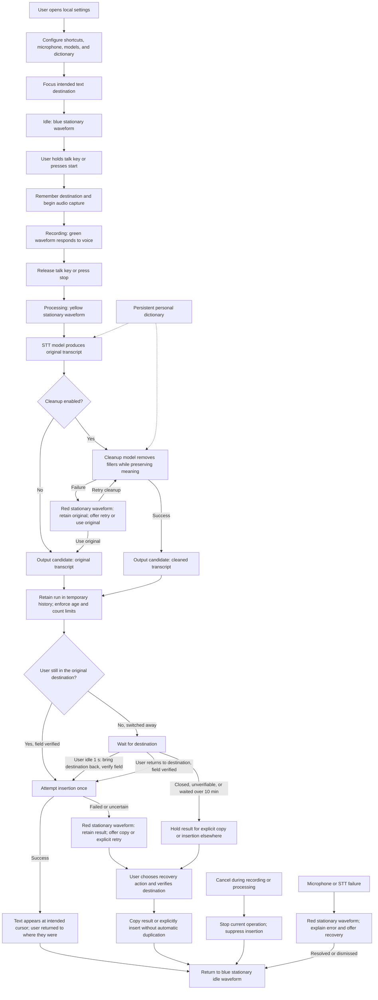

# Voice Dictation App — Feature Specification

Status: planning only. This document records the agreed first-version scope for a personal, local-model-capable, Wispr-style dictation app.

## Platform and local UI

- Target Windows, with development performed in WSL/Ubuntu.
- Proposed integration boundary: run microphone capture, global shortcuts, the overlay, and text insertion on Windows. Verify compatibility with the actual coding applications used, including any WSL GUI applications.
- Provide a local settings UI for shortcuts, microphone selection/testing, speech-to-text models, cleanup models, the personal dictionary, and temporary history.
- Keep settings and the personal dictionary persistent and separate from temporary recordings and transcripts.
- Model choices, UI framework, and whether to build independently or adapt OpenWhispr remain implementation decisions.

## Recording controls

- Support configurable global shortcuts for both hold-to-talk and press-to-start/press-to-stop operation.
- Provide a configurable cancel shortcut that stops the current operation without inserting text, including cancellation during processing.
- Remember the intended text destination when recording begins: the window, the browser tab when there is one, and the text field holding the cursor. That destination stays the target even if the user switches to other windows or tabs afterwards (see "Text insertion").
- Capture microphone audio temporarily for transcription.
- Allow normal pauses while recording; a pause does not automatically stop recording, submit text, or execute anything.
- Allow the user to select an input device and test it with an audio-level indicator in the settings UI.
- Explain unavailable microphones, permission problems, or disconnected input devices in the UI.

## Waveform overlay HUD

- Display a small waveform overlay without stealing focus from the destination application. (The deliberate, brief return to the destination described under "Text insertion" is separate from the overlay; the overlay itself never takes focus.)
- Use **blue, stationary bars** when idle/not in use.
- Use **green bars responding to the user's voice** while recording.
- Use **yellow, stationary bars** while loading models, transcribing, or cleaning text.
- Use **red, stationary bars** when an error occurs; make the error explanation accessible in the local UI.
- Animate the waveform only in the green recording state.
- Do not display “transcribing” or “cleaning” labels in the overlay.

## Speech-to-text and model control

- Convert captured audio into an original transcript using a selectable speech-to-text (STT) model.
- Configure the STT model and cleanup model separately.
- Support a fully local transcription and cleanup workflow once the required models are available.
- Show model readiness, loading/download status where applicable, and understandable errors in the settings UI.
- Provide a way to test the selected models.
- Do not silently fall back to a cloud service in local-only mode.
- Preserve the original transcript independently of the cleaned result.

## Meaning-preserving cleanup

- Allow cleanup to be enabled or disabled.
- Remove unnecessary fillers such as “uh” and “um” while preserving meaning and intended wording.
- Preserve meaningful uses of words such as “like” and “well.”
- Do not paraphrase, add information, or change names, numbers, negation, uncertainty, technical identifiers, or file paths.
- Allow cleanup instructions to be configured through the local UI.
- Treat dictated content as text to process, not as instructions to the cleanup model.
- If cleanup fails, retain the original transcript and offer retry or explicit use of the original. Do not discard the result or silently substitute altered content.

## Personal dictionary

- Maintain a user-specific persistent dictionary for preferred spellings of usernames, scientific vocabulary, names, project terms, and other unusual words.
- Support adding, editing, deleting, importing, and exporting dictionary entries.
- Allow optional recognition alternatives, such as “open whisper” mapping to “OpenWhispr.”
- Use dictionary guidance to improve recognition and preserve preferred spellings without blindly replacing words inside unrelated phrases.
- Do not expire dictionary entries with temporary history.

## Text insertion and action boundaries

- The destination captured when recording began is the only automatic target. Text never goes into whatever window the user happens to be in when processing finishes.
- If the user is still in the destination when the text is ready, verify it and insert at the intended cursor.
- **If the user switched away (hybrid delivery, decided 2026-09-24),** the result waits for its destination and is delivered by whichever comes first:
  - **Idle jump:** once the user has made no keyboard or mouse input for 1 second (configurable), the app brings the original window, and tab if any, to the front, verifies the text field, inserts once, and returns the user to the window and tab they were using. The return trip takes about half a second.
  - **Return:** if the user switches back to the destination themselves, the text is inserted as soon as the field is verified.
- Never jump back while the user is typing or using the mouse; wait instead.
- If the destination was closed, cannot be found, or its text field cannot be verified, or delivery has waited longer than 10 minutes (configurable), hold the result for explicit copy or insertion into a user-selected destination.
- The cancel shortcut also cancels a result that is waiting for delivery; it stays in temporary history.
- Several waiting results are delivered one at a time, in the order they were recorded.
- If insertion fails, retain the transcript and offer copy or retry.
- Prevent duplicate automatic insertion of a run. If insertion success is uncertain, require an explicit recovery action rather than blindly retrying.
- Retain results within the temporary-history limits so the user can copy them elsewhere.
- Perform only dictation, text insertion, and explicitly registered app controls.
- Never interpret arbitrary dictated speech as executable commands, automatically press Enter to submit text, send a message, or execute a terminal command.

## Temporary history and deletion

- Maintain a temporary local cache containing audio, the original transcript, and the cleaned transcript when available.
- Keep only the **10 most recent runs that are less than 24 hours old**. Both limits apply independently.
- When a new run exceeds the 10-run limit, delete the oldest retained run and its associated audio and transcripts.
- Delete a run when it reaches 24 hours old, even if fewer than 10 runs remain.
- Do not refresh a run's age when it is viewed, copied, or retried.
- Example: adding run 11 to runs `1–10` leaves `2–11`, with run 1 deleted.
- Example: if runs 2, 3, and 4 subsequently reach 24 hours old, delete them and retain `5–11`.
- Provide a Delete action in the local UI that removes a run's audio and transcripts together.
- Enforce expiration while the app runs and before showing history after reopening it. No separate always-running deletion service is required for this scope.
- Maintain no permanent audio/transcript archive. The cache storage technology remains an implementation decision.

## End-to-end process diagram

## Diagram description

- The user configures the app, focuses a text field, and activates their chosen recording shortcut.
- The app remembers that destination and captures audio while showing the green, voice-responsive waveform.
- Releasing the hold key or pressing stop ends capture. The waveform becomes yellow and remains still while the selected models process the recording.
- The STT model produces the original transcript. Optional cleanup removes fillers while preserving meaning; the original remains available.
- The run enters the temporary history, subject to both the 10-run limit and 24-hour expiration.
- If the user is still in the original destination, the app verifies it and inserts the output. If they switched away, the output waits for that destination: it is delivered once the user has been idle for a second (the app briefly brings the destination back and then returns them) or when they go back themselves. A closed or unverifiable destination, or a wait over 10 minutes, holds the output for the user's choice.
- An insertion error preserves the output for copy or explicit retry. Cancellation suppresses insertion. Errors use a stationary red waveform, and the app returns to stationary blue when idle.
- The final output is text inserted into the intended application or held/copied for the user, with no automatic submission or command execution.

## Features outside the current scope

- Voice snippets, spoken formatting, and automatic interpretation of spoken corrections.
- Automatic dictionary learning and per-application writing styles.
- Screen reading, autonomous voice commands, and meeting transcription.
- Accounts, billing, cross-device synchronization, and permanent recording archives.

## Acceptance checks

- Both trigger modes work, and cancellation during recording or processing inserts nothing.
- Only green recording bars animate; blue, yellow, and red states remain stationary.
- Pauses do not unexpectedly terminate a recording.
- Cleanup preserves the negation in “Do not delete that file” and preserves numbers, names, and technical terms.
- Switching to another window or tab during recording or processing delivers the text into the original field exactly once, either after the user is idle for 1 second or when they return, and never into the window they switched to.
- Nothing is inserted while the user is typing or using the mouse elsewhere, and the user ends up back in the window and tab they were using.
- A closed or unverifiable destination holds the text instead of inserting it anywhere.
- Failed or uncertain insertion does not cause automatic duplicate text.
- Cleanup failure leaves the original transcript available.
- Local STT and cleanup operate without internet after model setup.
- Adding an eleventh run removes the oldest; reaching 24 hours removes a run regardless of count.
- Manual deletion removes associated audio and both transcript versions while leaving settings and dictionary intact.
